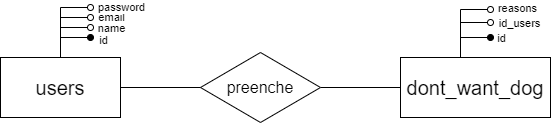
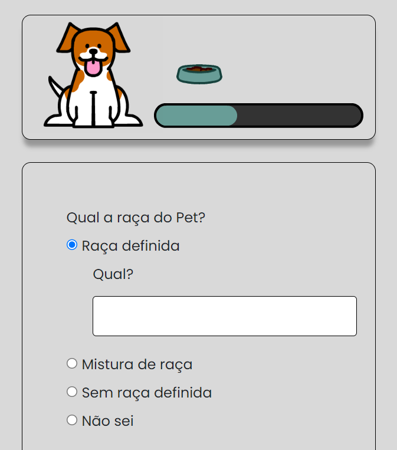
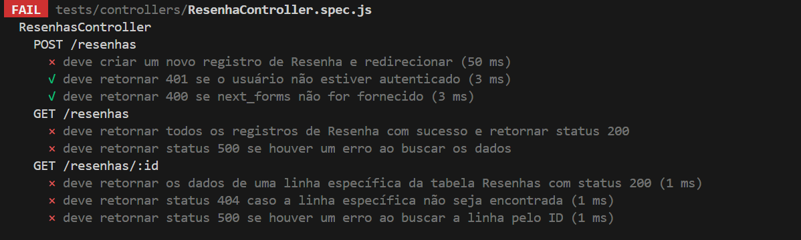
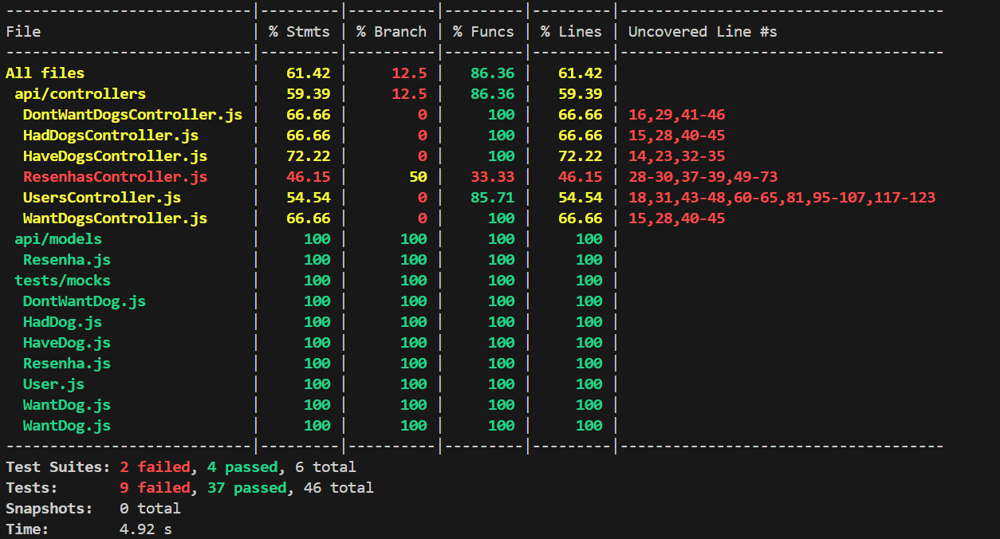

# WAD - Web Application Document - Módulo 2 - Inteli

## PsicoPets

#### Nomes dos integrantes do grupo

- <a href="https://www.linkedin.com/in/calebe-matias/">Calebe Yan Veras Matias</a>
- <a href="https://www.linkedin.com/in/giovanna-britto/">Giovanna Fátima de Britto Vieira</a>
- <a href="https://www.linkedin.com/in/gucolombini/">Gustavo Colombini</a> 
- <a href="https://www.linkedin.com/in/j%C3%BAlia-lika-ishikawa/">Júlia Lika Ishikawa</a> 
- <a href="https://www.linkedin.com/in/leonardo-ogata-983b032b5/">Leonardo Ogata Pedrosa</a>
- <a href="https://www.linkedin.com/in/lucas-ramenzoni-jorge-083770302/">Lucas Ramenzoni Jorge</a> 
- <a href="https://www.linkedin.com/in/wildis-filho/">Wildisley José de Souza Filho</a>

## Sumário

[1. Introdução](#c1)

[2. Visão Geral da Aplicação Web](#c2)

[3. Projeto Técnico da Aplicação Web](#c3)

[4. Desenvolvimento da Aplicação Web](#c4)

[5. Testes da Aplicação Web](#c5)

[6. Conclusões e trabalhos futuros](#c6)

[7. Referências](#c7)

[Anexos](#c8)

<br>

# <a name="c1"></a>1. Introdução 

&nbsp;&nbsp;&nbsp;&nbsp; O Instituto de Saúde e Psicologia Animal (INSPA) busca abordar a preocupante questão do abandono de cachorros através de uma pesquisa online dedicada a compreender os principais motivos por trás desse problema.

&nbsp;&nbsp;&nbsp;&nbsp; Dessa forma, desenvolvemos uma solução completa para o Instituto de Saúde e Psicologia Animal (INSPA), focada na criação de um website persuasivo para essa pesquisa. O site utiliza linguagem e elementos visuais para incentivar a participação dos usuários. Implementamos um sistema de login que garante respostas únicas por participante, assegurando a qualidade dos dados e também permite a criação de um sistema de gerenciamento de usuários e permissões para o acesso aos resultados da pesquisa de forma seletiva. A segurança e privacidade dos dados são prioridades, cumprindo os mais altos padrões éticos. O site oferece um feedback interativo para manter o engajamento dos participantes com o INSPA e suas iniciativas, garantindo uma experiência online confiável e eficaz. Esses aspectos foram cuidadosamente integrados para atender às necessidades específicas do cliente e garantir resultados valiosos na compreensão e resolução do problema do abandono de animais.

# <a name="c2"></a>2. Visão Geral da Aplicação Web 

## 2.1. Escopo do Projeto 

### 2.1.1. Contexto da indústria 

&nbsp;&nbsp;&nbsp;&nbsp; O Instituto de Saúde e Psicologia Animal (INSPA), criado em 2009, é uma organização que tem como propósito oferecer bem-estar aos seres vivos e para as sociedades nas quais eles estão inseridos. Sendo assim, são formados por um time de profissionais capacitados em comportamento e saúde animal, no qual por meio da plataforma digital o INSPA promove cursos e atividades de ensino, sendo referência na divulgação, formação, implementação e produção de conhecimento sobre as relações entre seres humanos e os demais animais. 

&nbsp;&nbsp;&nbsp;&nbsp; Por meio dessas atividades, eles atuam em um setor de constante crescimento que é impulsionado pelo crescimento da conscientização sobre o cuidado e o bem-estar dos animais, no qual diversos hospitais, clínicas veterinárias e instituições de pesquisa atuam. Desse modo, a concorrência no mercado é acirrada, em que diversas instituições de ensino e pesquisa em saúde animal também oferecem programas de treinamento e educação nessas áreas. 

&nbsp;&nbsp;&nbsp;&nbsp; A atuação do Inspa está concentrada em âmbito nacional, devido ao alcance da sua plataforma digital e dos seus programas de ensino à distância estarem em português, dessa forma, o seu alcance está delimitado no Brasil.

&nbsp;&nbsp;&nbsp;&nbsp; Dessa forma, o Instituto ocupa um espaço pioneiro na educação brasileira devido a criação de cursos e programas de pós-graduação que medem o bem-estar e a interação do seres humanos com os animais, como: o “Curso de Coprofragia Canina”,  “Manejo profissional de cães em grupo” e o curso “O Comportamento Canino pode ser Herdado?”.  Além disso, o INSPA recebe destaque ao utilizar ferramentas digitais e a Educação à Distância (EAD) para oferecer um ensino continuado acerca do seu propósito. Somado a isso, o instituto também atua na produção de livros, como por exemplo o livro Fundamentos do Comportamento Canino e Felino.

&nbsp;&nbsp;&nbsp;&nbsp; Todas as realizações do Instituto contribuíram para tornar uma área disciplinar em uma área multidisciplinar, para consolidar a psiquiatria veterinária e para divulgar sobre o bem-estar animal e suas interações. Atualmente, o Inspa consolida o seu protagonismo nos campos citados e com o desenvolvimento da área do vínculo entre ser humano e animal, sendo responsáveis por mais de dez turmas de pós-graduação em comportamento animal, ampliando a oferta dos cursos de pós-graduação e de habilitação.

### 2.1.2. Modelo de 5 Forças de Porter 

&nbsp;&nbsp;&nbsp;&nbsp;As 5 Forças de Porter é um modelo de análise competitiva que ajuda a entender a competitividade de um setor. Ou seja, o empreendedor passa a ter uma visão mais abrangente da concorrência e de como pode tirar proveito disso [[1]](#7-referências). Ele possui os seguintes pilares:

1. Rivalidade entre concorrentes, que estuda a composição do mercado em que a empresa está inserida e suas relações com competidores;

2. Ameaça de produtos substitutos, que analisa quais soluções de outras organizações podem vir a substituir as soluções e produtos oferecidos pela empresa em questão;

3. Poder de barganha dos fornecedores, que destaca a representatividade de diversos fornecedores e suas capacidades de negociação;

4. Ameaça de novos entrantes, que se relaciona com a possibilidade de empresas emergentes adentrarem o mercado com soluções inovadoras;

5. Poder de barganha dos compradores, que verifica o índice de negociação disponível aos consumidores das soluções e produtos da empresa analisada.

&nbsp;&nbsp;&nbsp;&nbsp;No caso do Instituto de Saúde e Psicologia Animal (INSPA), podemos aplicar esse modelo da seguinte forma:

<div align="center" width="100%">
<sub>Figura 1 - As 5 Forças de Porter.</sub>

<sup>Fonte: Material produzido pelos autores (2024).</sup>
</div>

### 2.1.3. Análise SWOT 

&nbsp;&nbsp;&nbsp;&nbsp; A análise SWOT, também conhecida como matriz FOFA, avalia fatores internos e externos de uma empresa ou projeto. Ela divide-se em quatro componentes: Forças, Fraquezas, Oportunidades e Ameaças. As forças diferenciam a organização, gerando valor, as fraquezas limitam o potencial, as oportunidades são fatores externos e positivos que uma organização pode aproveitar para expandir ou melhorar seu desempenho e as ameaças são fatores externos que podem representar desafios ou riscos para a organização [[2]](#7-referências). A análise SWOT permite estratégias eficazes e antecipação de desafios no contexto empresarial e tecnológico(Figura 2). No contexto do INSPA, conduzimos uma extensa pesquisa, culminando nos seguintes resultados:

## FORÇAS (S):

### Instituto já consolidado na área

&nbsp;&nbsp;&nbsp;&nbsp; O INSPA já se consolidou na área da psicologia animal, conferindo-lhe uma vantagem significativa sobre possíveis novos entrantes nesse mercado em ascensão.

### Vantagem Competitiva devido a grande variedade de cursos oferecidos

&nbsp;&nbsp;&nbsp;&nbsp; O INSPA oferece uma variada gama de cursos sobre o tema da psicologia animal, sendo assim uma das melhores opções para clientes que buscam uma grande quantidade de informação reunida em apenas um lugar.

### Nomes renomados no mercado da psicologia animal

&nbsp;&nbsp;&nbsp;&nbsp; O instituto também conta com profissionais renomados no mercado da psicologia animal ,como a professora Ceres Berger Faraco, em sua equipe, o que garante uma posição de destaque em relação a outros institutos.

### Parceria com outras organizações

&nbsp;&nbsp;&nbsp;&nbsp; O instituto tem feito diversas parcerias nos últimos anos. A parceria com o Inteli é apenas mais uma das diversas que surgiram nos últimos anos. Colaborações como que eles fizeram com a Universidade Tuiuti do Paraná (UTP), e até a própria parceria com o Inteli, fortalecem a credibilidade do Inspa e aumenta seu alcance.

### Qualificação dos profissionais

&nbsp;&nbsp;&nbsp;&nbsp; O Inspa possuí professores altamente qualificados, com diversas contribuições para a área animal. Isso sem dúvidas contribui para um conteúdo de mais qualidade, o que atraí ainda mais alunos.

## FRAQUEZAS (W):

### Público nichado

&nbsp;&nbsp;&nbsp;&nbsp; O público que os cursos oferecidos pelo INSPA antigo é um nicho muito específico da população brasileira, fazendo com que o instituto tenha um alcance limitado.

### Falta de Reconhecimento Público sobre o tema de estudo

&nbsp;&nbsp;&nbsp;&nbsp; Não só a psicologia, porém o bem estar animal como um todo é um tema que vem ganhando relevância recentemente, mas ainda não é dado a devida importância por maior parte da população.

### Poucas informações sobre o instituto

&nbsp;&nbsp;&nbsp;&nbsp; No site oficial do site é dito muito pouco sobre o INSPA deixando a interpretação do usuário qual é o real trabalho do instituto que muitas vezes é confundido com uma ONG, por essa comunicação falha.

### Atualização insuficiente dos canais de comunicação

&nbsp;&nbsp;&nbsp;&nbsp; Atualmente o Instituto utiliza pouco seus canais de comunicação como seu canal no YouTube em que o último vídeo postado foi há mais de 1 ano, assim, diminuindo uma possível forma de aumento de alcance.

### Dependência da liderança individual

&nbsp;&nbsp;&nbsp;&nbsp; Embora a liderança da Prof. Dra. Ceres Berger Faraco seja um ponto forte, a sua dependência excessiva pode surgir como uma fraqueza. Grandes institutos não podem depender apenas de uma pessoa, vide o Inteli.

## OPORTUNIDADES (O):

### Aumento do Interesse Público em Bem-Estar Animal

&nbsp;&nbsp;&nbsp;&nbsp; Como mencionado anteriormente o interesse do público pelo bem estar animal começou uma crescente recentemente, e esse aumento tende a continuar nos próximos anos se tornando assim uma grande oportunidade para o INSPA.

### Colaborações Interdisciplinares

&nbsp;&nbsp;&nbsp;&nbsp; Devido a variedade das pesquisas dessa área, existem muitas oportunidades quando pensamos em colaborações interdisciplinares como por exemplo relações entre o uso da tecnologia no adestramento de animais domésticos.

### Expansão da marca através do marketing

&nbsp;&nbsp;&nbsp;&nbsp; O INSPA possui uma grande oportunidade de expandir seu alcance através de um melhor uso de marketing se tornando mais ativos nas redes sociais.

### Pirataria Digital

&nbsp;&nbsp;&nbsp;&nbsp; Atualmente cursos vendidos em plataformas como [Hotmart](https://hotmart.com/pt-br) (que é o caso dos cursos do INSPA) são frequentes alvos de pirataria digital, fazendo com que muitas pessoas consumam o conhecimento sem pagar.

## AMEAÇAS (T):

### Surgimento de concorrentes

&nbsp;&nbsp;&nbsp;&nbsp; Por ser uma área do conhecimento que está crescendo no mercado atualmente há uma grande possibilidade de surgimento de novos concorrentes.

### Escassez de funcionários

&nbsp;&nbsp;&nbsp;&nbsp; Por se tratar de uma área de estudo nova, atualmente existe uma escassez de funcionários que possam atuar.

### Pirataria Digital

&nbsp;&nbsp;&nbsp;&nbsp; Atualmente cursos vendidos em plataformas como Hotmart (que é o caso dos cursos do INSPA) são frequentes alvos de pirataria digital, fazendo com que muitas pessoas consumam o conhecimento sem pagar.

### Desafios tecnológicos

&nbsp;&nbsp;&nbsp;&nbsp; Atualmente, os cursos do Inspa são disponibilizados em plataformas digitais. Problemas como falhas no sistema ou ataques cibernéticos podem acontecer, e isso pode afetar a confiança e a reputação do instituto com seus clientes.

<div align="center">
<sub>Figura 1 - Análise SWOT do Projeto</sub>

<sup>Fonte: Material produzido pelos autores (2024)</sup>
</div>

### 2.1.4. Solução: 

**1. qual é o problema a ser resolvido**

&nbsp;&nbsp;&nbsp;&nbsp; Não existe uma base de dados completa e detalhada que explicite as causas de uma adoção, compra ou abandono de um animal. Desse modo, não é possível prevenir comportamentos adversos de tutores, pois no momento os motivos racionais, subjetivos e todos os aspectos que se associam ao ato de abandono, por exemplo, não são claros. 

**2. quais os dados disponíveis**

&nbsp;&nbsp;&nbsp;&nbsp; Para estruturar e idealizar a aplicação tomamos cuidado para que, a partir das nossas fontes de pesquisa, possamos ter uma proximidade maior com as necessidades do INSPA e um entendimento mais proveitoso da necessidade do projeto Abandono Zero, para assim comunicar tais aspectos com veracidade. Para atingir tal objetivo, as únicas fontes utilizadas foram as disponibilizadas pelo parceiro, ou seja, o documento de [apresentação da instituição](https://drive.google.com/file/d/181eISpqDTrA0mXLsVF2PnV7DINjSX2AI/view), o [TAPI](https://docs.google.com/document/d/1H4YH-q7_-jvwPKMK-RwKPoLIRAhGtWPFMqaQPH2nOho/edit) que descreve em detalhes o escopo e objetivo do projeto e, por fim, o [questionário base](https://inteli-college.slack.com/files/U049107B7MZ/F06V33D6LNQ/base_question__rio__abandonozero__q1_-_inteli__e_inspa.pdf), que devemos tomar como prioridade ao desenvolver o approach do site.
 
**3. qual a solução proposta** 

&nbsp;&nbsp;&nbsp;&nbsp; Desenvolvimento de aplicação web gamificada e responsiva para coletar dados sobre o motivo da  adoção, compra e abandono de cães e gatos, visando entender e reduzir o índice de negligência e maus-tratos. Compatível com navegadores Chrome, Firefox, para dispositivos móveis e desktops. 

**4. como a solução proposta deverá ser utilizada**

&nbsp;&nbsp;&nbsp;&nbsp; A aplicação será utilizada de forma a coletar dados quanto aos motivos do possível abandono, adoção e/ou compra de cães, para que assim possa ser feita uma análise de tais dados para buscar formas de prevenir os casos em que o abandono ocorre.

**5. quais os benefícios trazidos pela solução proposta**

&nbsp;&nbsp;&nbsp;&nbsp; A partir de uma análise dos dados coletados pela aplicação, o pensamento que leva a um eventual abandono de um cão poderá ser explicitado e evidenciado para o time da INSPA, que pode então agir perante tais informações e lançar ações que controlam e/ou mitigam o índice de animais abandonados e maltratados.

**6. qual será o critério de sucesso e qual medida será utilizada para o avaliar**

&nbsp;&nbsp;&nbsp;&nbsp; O sucesso do nosso projeto será medido pela eficácia da aplicação web em coletar e mapear dados sobre adoção, compra e abandono de cães. O critério de sucesso envolverá a capacidade de identificar padrões comportamentais que fundamentem propostas de ações concretas para diminuir o abandono e maus-tratos, avaliado pela redução quantitativa desses índices.

### 2.1.5. Proposta de Valor 

&nbsp;&nbsp;&nbsp;&nbsp; O Canvas de Proposta de Valor é uma ferramenta estratégica que permite aos empreendedores e empresários desenhar, testar, visualizar e aprimorar produtos e serviços por meio da compreensão das necessidades, desejos e desafios dos clientes ou usuários. Essa ferramenta é dividida em duas partes, sendo uma relacionada ao cliente e a outra à proposta de valor que está sendo desenvolvida, cada uma delas subdividida em 3 partes. [[3]](#7-referências)

Na parte do cliente, temos:

- **Trabalhos do Cliente:** Representam as tarefas ou problemas que os clientes estão tentando realizar sem o produto ou solução oferecidos.

- **Dores:** Representam os desafios, obstáculos, frustrações e riscos que os clientes enfrentam ao tentar realizar seus trabalhos.

- **Ganhos:** Representam os resultados desejados, os benefícios ou as aspirações que os clientes esperam alcançar ou experimentar ao realizar seus trabalhos com sucesso.

Já na proposta de valor, a divisão é a seguinte:

- **Produtos e Serviços:** Referem-se aos recursos, funções e benefícios dos produtos ou serviços oferecidos pela organização.

- **Alívio da Dor:** Representa as maneiras pelas quais os produtos ou serviços da organização aliviam ou tratam as dores sentidas pelos clientes.

- **Criadores de Ganhos:** Representa as maneiras pelas quais os produtos ou serviços da organização proporcionam os resultados ou benefícios desejados que os clientes estão buscando.

<div align="center">
<sub>Figura 2 - Análise SWOT do Projeto</sub>


<sup>Fonte: Material produzido pelos autores (2024)</sup>
</div>

### 2.1.6. Matriz de Riscos

&nbsp;&nbsp;&nbsp;&nbsp;A elaboração de uma matriz de riscos é uma ferramenta fundamental para a gestão do projeto, pois permite identificar e categorizar os possíveis riscos do projeto com antecedência. A maneira como isso é feita é por meio da ordenação dos riscos do projeto em uma tabela, levando em consideração o impacto de um risco e a sua probabilidade. <br>
&nbsp;&nbsp;&nbsp;&nbsp;A matriz de risco facilita a análise de potenciais desafios de forma visual, possibilitando que a equipe determine quais devem receber mais atenção, e então implementar estratégias para lidar com esses obstáculos, reduzindo a probabilidade de problemas inesperados.

<div align="center">
<sub>Matriz de Risco do Projeto - Sprint 1</sub>


<sup>Fonte: Material produzido pelos autores (2024)</sup>
</div>

\# | Legenda
--- | --- 
1 | Alteração das perguntas 
2 | Problemas com imagens no site
3 | Falta de energia na casa de alguém
4 | Problemas com as ferramentas
5 | Desacordo dentro da equipe
6 | Queda dos serviços em nuvem
7 | Perda de edições de um integrante
8 | Erros de escrita/ortografia em documentos
9 | Commit incorreto no repositório
10 | Comunicação farta entre a equipe
11 | Integrante incapacitado
12 | Incompatibilidade em diferentes plataformas
13 | Erros de escrita/ortografia no site
14 | Respondente não responde com honestidade
15 | Tempo insuficiente (ex: ponderadas)
16 | Necessidade de refatoração
17 | Site não suficientemente atrativo
18 | Erros no envio do formulário
19 | Base de dados má formatada
20 | Atraso/Esquecimento de alguma entrega
21 | Brecha da base de dados
22 | Site vulnerável
23 | Incompreensão do grupo sobre o projeto
24 | Insatisfação do parceiro com a entrega
25 | Projeto entregue com bugs graves

### Possíveis Planos de Atuação:
- Comunicação com o parceiro sobre quaisquer dúvidas, questões e sugestões;
- Realizar revisão de qualidade e testes rigorosos antes de cada release;
- Implementar métodos robustos de criptografia nas bases de dados;
- Resolver conflitos de ideias por meio de votações e mediação;
- Manter backups de versões anteriores facilmente acessíveis;
- Continuar fazendo uso das estratégias de gerenciamento de equipe (ex.: SCRUM);
- Assegurar anonimato e confidencialidade das respostas ao tutor.

## 2.2. Personas 

&nbsp;&nbsp;&nbsp;&nbsp;Personas são personagens fictícios desenvolvidos para representar os diversos tipos de usuários que interagem com ou consumem um determinado produto ou serviço. Esses perfis são elaborados com base em dados sobre comportamento, preferências e necessidades dos usuários reais, oferecendo uma representação detalhada e humanizada do público-alvo [[4]](#7-referências). Ao analisar as experiências, aspirações e desafios enfrentados pelos usuários em seu dia a dia, as personas proporcionam uma visão aprofundada e empática do contexto em que o produto ou serviço será utilizado. Além disso, as personas não apenas destacam os obstáculos que os usuários enfrentam, mas também identificam os ganhos que eles almejam alcançar ao adotar o produto ou serviço. No contexto do projeto AbandonoZero do INSPA, a definição de personas desempenha um papel de orientar o desenvolvimento da nossa aplicação WEB, permitindo que a equipe compreenda as necessidades específicas dos dois perfis principais que interagirão com o site. Ao incorporar as personas em todo o processo de concepção e implementação, o projeto pode garantir uma abordagem centrada nos usuários e, consequentemente, oferecer uma solução mais eficaz para extrair e disponibilizar os dados para os pesquisadores do INSPA.<br>

&nbsp;&nbsp;&nbsp;&nbsp;A seguir, estão as personas que representam os dois perfis principais que terão acesso ao questionário desenvolvido:

<div align="center" width="100%">
<sup>Figura 3 - Persona 1: Baseada no pesquisador que receberá acesso admin do site</sup>
    
    <br>
    <sup>Fonte: Material produzido pelos autores (2024).</sup>
    <br><br>
    <sup>Figura 4 - Persona 2: Baseada no voluntário que responderá o formulário
    </sup>
    
    <br>
    <sup>Fonte: Material produzido pelos autores (2024).</sup>
</div>

## 2.3. User Stories 

&nbsp;&nbsp;&nbsp;&nbsp;User Stories são os documentos utilizados para descrever funcionalidades de uma solução que está sendo criada dentro da metodologia ágil. O objetivo desse esquema de documentos se baseia em comunicar a visão do cliente e como ela deverá ser implementada pelo time de desenvolvimento [4].<br>

&nbsp;&nbsp;&nbsp;&nbsp;Dado isso, tendo como base o design preliminar do site e a delimitação da solução, os seguintes documentos foram feitos:

<div align=center width="100%">
<sup>Quadro 1 - User Stories</sup>

  
<sup>Fonte: Material produzido pelos autores (2024).</sup>
<br><br>
<sup>Quadro 2 - User Stories</sup>

<sup>Fonte: Material produzido pelos autores (2024).</sup>
<br><br>
<sup>Quadro 3 - User Stories</sup>

<sup>Fonte: Material produzido pelos autores (2024).</sup>
<br><br>
<sup>Quadro 4 - User Stories</sup>

<sup>Fonte: Material produzido pelos autores (2024).</sup>
<br><br>
<sup>Quadro 5 - User Stories</sup>

<sup>Fonte: Material produzido pelos autores (2024).</sup>
<br><br>
<sup>Quadro 6 - User Stories</sup>

<sup>Fonte: Material produzido pelos autores (2024).</sup>
<br><br>
<sup>Quadro 7 - User Stories</sup>

<sup>Fonte: Material produzido pelos autores (2024).</sup>
<br><br>
</div>

# <a name="c3"></a>3. Projeto da Aplicação Web 

## 3.1. Arquitetura

&nbsp;&nbsp;&nbsp;&nbsp;O Diagrama MVC (Figura 5), é um esquema que organiza de maneira visual os fluxos dos dados dentro de uma aplicação _web_. O esquema se divide em 3 camadas: _Models_, _Views_ e _Controllers_, os quais dão origem ao nome da diagrama [[8]](#7-referências).

&nbsp;&nbsp;&nbsp;&nbsp; No diagrama, a camada de _Views_ representa os elementos com os quais o usuário é capaz de interagir, contendo, por exemplo, as páginas da aplicação. Apesar de ser a camada com a qual o usuário interage, este nível não interage diretamente com o banco de dados, sendo essa ação intermediada pela camada de _Controllers_. 

&nbsp;&nbsp;&nbsp;&nbsp; Os _Controllers_, como citado anteriormente, intermedeiam as relações de _Views_ com os _Models_, estabelecendo as ações que podem ser feitas no banco de dados da aplicação, como inserir ou remover informações, tendo suas funções acessadas pela camada de _Views_ através das [rotas](https://sailsjs.com/documentation/concepts/routes). Além disso, os _Controllers_ podem se utilizar dos _Helpers_, uma estrutura particular do [Sails.js](https://sailsjs.com/) que encapsula funções usadas dentro da aplicação de modo a evitar repetições. Os _helpers_, em geral, apresentam funções relacionadas a formatação e validação de informações.

&nbsp;&nbsp;&nbsp;&nbsp; Por fim, a camada de _Models_ é responsável por estabelecer como os dados estão organizados dentro do banco de dados, possibilitando que as informações possam ser relacionadas, consultadas e gravadas de forma estruturada. 

&nbsp;&nbsp;&nbsp;&nbsp; Para aplicação da arquitetura desemvolvida, foi utilizado o [Sails.js](https://sailsjs.com/), um framework para [Node.js](https://nodejs.org/en) que possibilita a criação de aplicações _web_ organizados em MVC. Essa ferramenta auxilia no processo de desenvolvimento tornando-o mais simples e rápido, ao conter diversos comandos nativos para relacionamento e organização das diferentes entidades dessa arquitetura. 

&nbsp;&nbsp;&nbsp;&nbsp; Ademais, utilizou-se como servidor e servidor de banco de dados o serviço em nuvem [Render](https://render.com/), com o banco de dados sendo o [Postgre](https://www.postgresql.org/), ambas as escolhas se devem a facilidade de uso e as funcionalidades disponíveis.

<div align="center">
<sup>Figura 5 - Diagrama MVC</sup>

</img>

<sub>Fonte: Material produzido pelos autores, 2024</sub>
</div>

&nbsp;&nbsp;&nbsp;&nbsp; Na arquitetura MVC desenvolvida, cabe destacar componentes presentes em cada uma das _Views_ de nossa aplicação, sendo os seguintes:

- **Página de Login:**
    - **Inserir email:** campo para inserir e-mail;
    - **Inserir senha:** campo para inserir a senha.

- **Página de Cadastro:**
    - **Inserir nome:** campo para o usuário inserir o seu nome;
    - **Inserir email:** campo para inserir o email;
    - **Inserir senha:** campo para inserir a senha;
    - **Confirmar senha:** campo para inserir a confirmação da senha.

- **GeneralForms:**
    - **Perguntas:** representa as perguntas do formulário de coleta de dados demográficos;
    - **Campos de Resposta:** representa os campos para o usuário responder as questões.

- **formsHave:**
    - **Perguntas:** representa as perguntas do formulário para pessoas que convivem com cães;
    - **Campos de Resposta:** representa os campos para o usuário responder as questões.

- **formsWant:**
    - **Perguntas:** representa as perguntas do formulário para pessoas que querem conviver com cães;
    - **Campos de Resposta:** representa os campos para o usuário responder as questões.

- **formsHad:**
    - **Perguntas:** representa as perguntas do formulário para pessoas que conviveram com cães;
    - **Campos de Resposta:** representa os campos para o usuário responder as questões.

- **formsNull:**
    - **Perguntas:** representa as perguntas do formulário para pessoas que não querem conviver com cães;
    - **Campos de Resposta:** representa os campos para o usuário responder as questões.

- **Dashboard do Adm:**
    - **Gráficos:** representam gráficos com as respostas dos usuários;
    - **Quantidade de respostas:** representam informações quantitativas das respostas dos usuários.

- **Página de Inicial:**
    - **Imagens:** representam imagens;
    - **Título:** representam o título da página;
    - **Resumo do Projeto:** representa um resumo com informações do projeto;
    - **Carrossel:** representam um carrossel com dados sobre abandono;
    - **Footer:** representam um rodapé com informações do projeto e da equipe;

&nbsp;&nbsp;&nbsp;&nbsp; Por sua vez, tem-se como componentes presentes no _models_ os seguintes:

- **users**
    - **id:** número identificador do usuário;
    - **name:** nome do usuário;
    - **email:** email do usuário;
    - **password:** senha do usuário;
    - **role:** identifica o tipo de acesso que o usuário terá.

- **resenha:**
    - **id:** número identificador da tabela;
    - **id_users:** chave estrangeira que identifica o usuário que respondeu o questionário;
    - **age:** idade do usuário;
    - **sex:** sexo do usuário;
    - **education_level:** nível de escolaridade do usuário;
    - **house_type:** tipo de moradia do usuário;
    - **family_constitution:** constituição familiar do usuário.

- **have_dog:**
    - **id:** número identificador da tabela;
    - **user_id:** chave estrangeira que identifica o usuário que respondeu o questionário;
    - **dogs_name:** nome do cachorro;
    - **dogs_sex:** sexo do cachorro;
    - **tutor:** nome do tutor do cachorro;
    - **castrated:** castração do cachorro;
    - **castration_date:** data da castração do cachorro.

- **want_dog:**
    - **id:** número identificador da tabela;
    - **id_users:** chave estrangeira que identifica o usuário que respondeu o questionário;
    - **dogs_size:** tamanho do cachorro;
    - **fur_length:** pelagem do cachorro;
    - **fur_color:** cor da pelagem do cachorro;
    - **dogs_sex:** sexo do cachorro;
    - **dogs_age:** idade do cachorro.

- **had_dog:**
    - **id:** número identificador da tabela;
    - **id_users:** chave estrangeira que identifica o usuário que respondeu o questionário;
    - **dogs_name:** nome do cachorro;
    - **belonging:** nome de quem pertence o cachorro;
    - **dogs_personality:** personalidade do cachorro;
    - **how_much_stayed:** quanto tempo o cachorro conviveu com a família;
    - **first_dog:** informa se é o primeiro cão ou não.

- **dont_want_dog:** 
    - **id:** número identificador da tabela;
    - **id_users:** chave estrangeira que identifica o usuário que respondeu o questionário;
    - **motivos:** motivo do porque o usuário não quer cachorro;

- **reasons_to_have_the_dog:**
    - **id:** número identificador da resposta;
    - **kids_company:** companhia para as crianças;
    - **adults_company:** companhia para adultos;
    - **appearance:** pela aparência;
    - **dogs_company:** companhia para outros cachorros;
    - **responsibility_to_children:** ensinar responsabilidade para as crianças;
    - **friends_have:** amigos tem.

&nbsp;&nbsp;&nbsp;&nbsp; Além dos componentes citados previamente, devemos considerar também os _controllers_ e suas respectivas funções, como apresentado a seguir:

- **userController**
    - **create:** grava as informações da página de login e da página de cadastro no modelo "users".

- **ResenhaController**
    - **create:** grava as informações inseridas no formulário de informações demográficas no modelo "resenha".

- **HaveDogsController**
    - **create:** grava as informações inseridas no formulário para pessoas que convivem com cães no modelo "have_dog".

- **WantDogsController**
    - **create:** grava as informações inseridas no formulário para pessoas que querem conviver com cães no modelo "want_dog".

- **HadDogsController**
    - **create:** grava as informações inseridas no formulário para pessoas que conviveram com cães no modelo "had_dog".

- **DontWantDogsController**
    - **create:** grava as informações inseridas no formulário para pessoas que não querem conviver com cães no modelo "dont_want_dog".

- **dashboard**
    - **procurar:** procura as informações nos modelos "resenha", "have_dog", "want_dog", "had_dog", "dont_want_dog" e "reasons_to_have_the_dog";
    - **listar:** lista as informações dos modelos "resenha", "have_dog", "want_dog", "had_dog", "dont_want_dog" e "reasons_to_have_the_dog" na _View_ "dashboard".

&nbsp;&nbsp;&nbsp;&nbsp; Por fim, com base nos componentes dessa arquitetura é possível estabelecer o fluxo de operações:

**Fluxo de Login e Cadastro de Usuários**
- **Cadastro:**
1. O usuário acessa a página de cadastro, preenche os campos necessários e submete o formulário.
2. O controlador "userController" recebe os dados, valida-os, usando dos _helpers_, e utiliza o método "create" para inserir as informações no banco de dados através do modelo "users".
3. Após o registro, o usuário pode ser redirecionado para a página de login ou diretamente para o dashboard, dependendo do seu "role".

- **Login:**
1. O usuário preenche suas credenciais na página de login.
2. O controlador "userController" ativa o método procurar para verificar as credenciais.
3. Se as credenciais estiverem corretas, o usuário é redirecionado ao dashboard apropriado (usuário ou administrador).

**Fluxo de Preenchimento dos Formulários**

- **Tabela Resenha**
1. O usuário acessa o formulário específico para dados demográficos.
2. Após preencher as informações requeridas como idade, sexo, nível de escolaridade, tipo de moradia e constituição familiar, submete o formulário.
3. O controlador "ResenhaController" recebe os dados, valida-os, usando dos _helpers_, e utiliza o método gravar para inserir as informações na tabela resenha através do modelo correspondente.

- **Tabela have_dog**
1. O usuário preenche o formulário destinado aos tutores que possuem cachorros.
2. As informações como nome do cachorro, sexo, castração e data da castração são inseridas e submetidas.
3. O controlador "HaveDogController" capta esses dados, realiza as validações necessárias, usando dos _helpers_, e emprega o método "create" para salvar os dados na tabela "have_dog".

- **Tabela want_dog**
1. O usuário acessa e responde o formulário sobre suas preferências para um futuro cachorro, incluindo tamanho, pelagem, cor e idade do cachorro desejado.
2. Após preencher, submete o formulário.
3. O controlador "WantDogsController" processa as respostas, valida-as, usando dos _helpers_, e usa o método "create" para inserir os dados na tabela "want_dog".

- **Tabela had_dog**
1. O usuário preenche o formulário destinado a informações sobre cachorros que já tiveram, incluindo nome do cachorro, quem o pertencia, personalidade, tempo de convivência e se era o primeiro cachorro.
2. O formulário é submetido.
3. O controlador "HadDogsCOntroller" recebe os dados, valida-os, usando dos _helpers_, e utiliza o método "create" para armazenar as informações na tabela had_dog.

- **Tabela dont_want_dog**
1. O usuário acessa o formulário para expressar os motivos pelos quais não deseja ter cachorros.
2. Ele submete o formulário após preencher os motivos.
3. O controlador "DontWantDogsController" verifica as informações, realiza as validações necessárias, usando dos _helpers_, e grava-as na tabela dont_want_dog usando o método "create".

- **Tabela reasons_to_have_the_dog**
1. O usuário responde ao formulário destacando os motivos para ter um cachorro, como companhia para crianças ou adultos, aparência do cachorro, entre outros.
2. O formulário é submetido.
3. O controlador "ReasonsToHaveADogController" coleta esses dados, valida-os, usando dos _helpers_, e grava-os na tabela "reasons_to_have_the_dog".

**Fluxo de Visualização no Dashboard Administrativo**
1. O administrador acessa o dashboard.
2. O controlador dashboard executa os métodos procurar e listar para buscar e exibir os dados dos modelos pertinentes. Isso inclui informações sobre as respostas dos formulários, que são então apresentadas em gráficos e resumos estatísticos.
3. O administrador pode filtrar ou selecionar dados específicos para visualizar ou exportar, usando os controles disponíveis na _View_.

&nbsp;&nbsp;&nbsp;&nbsp; Cada um desses fluxos de operações demonstram que os dados coletados através de interações do usuário na interface da aplicação sejam processados de maneira eficiente, validados e armazenados de forma segura no banco de dados, seguindo as práticas do modelo MVC para garantir organização, escalabilidade e facilidade de manutenção.

## 3.2. Wireframes 
### 3.2.1 COntextualização e descrição
&nbsp;&nbsp;&nbsp;&nbsp; Em web design, _Wireframes_ são uma representação visual da estrutura e funcionalidade de uma página web ou tela de celular. Esses esboços são utilizados no início do processo do desenvolvimento da aplicação para estabelecer a estrutura preliminar da página antes da adição de elementos visuais, paleta de cores e conteúdo. _Wireframes_ podem ser criados no papel, utilizando ferramentas de design gráfico, ou mesmo em HTML/CSS, que ajudam a visualizar a disposição dos elementos e a navegação do usuário [[6]](#7-referências).

&nbsp;&nbsp;&nbsp;&nbsp; Dessa forma, para obter a validação da aplicação antes do seu desenvolvimento foram definidos alguns tipos de _Wireframes_, sendo três principais: _wireframe_ de baixa fidelidade, _wireframe_ de média fidelidade e _wireframe_ de alta fidelidade, sendo que a quantidade de detalhes é o que diferencia cada uma deles.

&nbsp;&nbsp;&nbsp;&nbsp; Conforme apresentado pelo [MindGroup technologies](https://mindconsulting.com.br/), os _wireframes_ de baixa fidelidade são representações visuais básicas e servem como ponto de partida do design. Eles omitem detalhes distrativos e incluem imagens simplistas, blocos e conteúdos simulados. Enquanto isso, os _wireframes_ de média fidelidade representam mais precisamente o layout da aplicação, contendo imagens e tipografias, com alguns detalhes atribuídos a componentes e recursos específicos. Por fim, os wireframes de alta fidelidade apresentam os layouts específicos para pixels, e incluem o preenchimento de textos pseudo-latino e caixas preenchidas com um “X” para representar uma imagem [[7]](#7-referências).

&nbsp;&nbsp;&nbsp;&nbsp; Sendo assim, considerando as necessidades do projeto foram feitos _wireframes_ de média fidelidade para as telas de início, login, cadastro e dashboard do administrador. Já as telas dos formulários consistem de _wireframes_ de alta fidelidade devido a relevância do conteúdo escrito e dos elementos dos formulários (Figura 5).

<div align="center">

<sup>Figura 5 - Wireframe Geral: Versão Mobile.</sup>


<sup>Fonte: Material produzido pelos autores (2024).</sup>

</div>

&nbsp;&nbsp;&nbsp;&nbsp; Além disso, partindo dos princípios do "_Mobile First_", desenvolvido por Luke Wroblewski entre 2009 e 2010, os _wireframes_ foram elaborados considerando primeiro os dispositivos móveis, objetivando que os usuários tenha a melhor experiência possível com a aplicação, tendo em vista que a grande maioria do nosso público a acessará por esses meios.

&nbsp;&nbsp;&nbsp;&nbsp; Dessa forma, a primeira tela desenvolvida consiste na tela inicial (Figura 6) que apresenta uma _navbar_ com a logo do projeto (que redireciona para a tela inicial), um ícone de login (que redireciona para a página de login) e um menu (que expõe um menu suspenso com as possíveis abas para navegação). Também há a área de conteúdo principal que contém uma imagem com um título, um subtítulo centralizado e um botão que redireciona para a página de login. Ademais, foi disposto um texto cortado na tela, que serve como incentivo para o usuário rolar a tela para baixo e ver o restante do conteúdo.

<div align="center">

<sup>Figura 6 - Wireframe Tela Inicial: Versão Mobile.</sup>


<sup>Fonte: Material produzido pelos autores (2024).</sup>

</div>

&nbsp;&nbsp;&nbsp;&nbsp; A segunda tela (Figura 7) desenvolvida consiste em uma página de login que possui caixas de texto para o usuário inserir e-mail e senha, além de um botão para o envio dessas informações, um link para a página de cadastro e outro link para recuperação de senha.

<div align="center">

<sup>Figura 7 - Wireframe Tela de Login: Versão Mobile.</sup>


<sup>Fonte: Material produzido pelos autores (2024).</sup>

</div>

&nbsp;&nbsp;&nbsp;&nbsp; Já a terceira tela elaborada (Figura 8) foi uma página de cadastro, a qual contém o título da página, quatro caixas de texto para inserção do nome, e-mail, senha e confirmação de senha do usuário, além de apresentar o botão de cadastro e o rodapé da página.

<div align="center">

<sup>Figura 8 - Wireframe Tela de Cadastro: Versão Mobile.</sup>


<sup>Fonte: Material produzido pelos autores (2024).</sup>

</div>

&nbsp;&nbsp;&nbsp;&nbsp; Além disso, conforme disponibilizado pelo parceiro, foram elaborados formulários para a coleta de dados que englobe os diferentes perfis de como as pessoas interagem com cães. Cada formulário inclui perguntas a serem respondidas pelo usuário, bem como diferentes formas de coleta de resposta, tais como caixas de texto, caixas de seleção, _radioButtons_, _date chooser_, _num. Stepper_ e outros. Dessa forma, nota-se como os _wireframes_ seguintes são mais robustos e apresentam informações e elementos mais consistentes.

&nbsp;&nbsp;&nbsp;&nbsp; Nesse sentido, tem-se o formulário "resenha", ou "generalForms", como primeiro apresentado ao usuário, sendo responsável por coletar informações demográficas de todos aqueles que preencham a pesquisa (Figura 9). 

<div align="center">

<sup>Figura 9 - Wireframe Formulário Resenha: Versão Mobile.</sup>


<sup>Fonte: Material produzido pelos autores (2024).</sup>

</div>

&nbsp;&nbsp;&nbsp;&nbsp; Após a elaboração do formulário para dados demográficos, construiu-se um _wireframe_ destinado a pessoas que convivem com cães (Figura 10), entretanto, devido ao grande número de perguntas do formulário, o questionário foi dividido em 4 partes com perguntas distintas em cada uma delas, almejando também trazer maior conforto ao usuário durante o seu preenchimento.

<div align="center">

<sup>Figura 10 - Wireframe Formulário Presente: Versão Mobile.</sup>


<sup>Fonte: Material produzido pelos autores (2024).</sup>

</div>

&nbsp;&nbsp;&nbsp;&nbsp; Da mesma maneira, fez-se um _wireframe_ para o formulário destinado a pessoas que tiveram cães no passado (Figura 11).

<div align="center">

<sup>Figura 11 - Wireframe Formulário Passado: Versão Mobile.</sup>


<sup>Fonte: Material produzido pelos autores (2024).</sup>

</div>

&nbsp;&nbsp;&nbsp;&nbsp; Seguindo o padrão previamente estabelecido, criou-se também um _wireframe_ relativo ao formulário destinado a pessoas que desejam, futuramente, conviver com cães. (Figura 12)

<div align="center">

<sup>Figura 12 - Wireframe Formulário Futuro: Versão Mobile.</sup>


<sup>Fonte: Material produzido pelos autores (2024).</sup>

</div>

&nbsp;&nbsp;&nbsp;&nbsp; Por fim, visando a visualização de informações sobre o alcance da pesquisa e respostas dos usuários, produziu-se uma página de dashboard (Figura 13), disponível apenas para usuários cadastrados como "admin", isto é, pessoas previamente autorizadas pelo INSPA para usar dos dados. Esta página também permite o download dos dados de todos os formulários para outras análises.

<div align="center">

<sup>Figura 13 - Wireframe Dashboard: Versão Mobile.</sup>


<sup>Fonte: Material produzido pelos autores (2024).</sup>

</div>

&nbsp;&nbsp;&nbsp;&nbsp; Da mesma maneira que foram feitos _wireframes_ para dispositivos móveis, foram construídos equivalentes para desktop. Nessa versão foram utilizados os mesmos elementos da versão mobile, porém as dimensões e proporções se modificaram, porém é possível notar que tanto o _header_ e o _footer_ se mantém em todas as páginas, enquanto nas outras páginas os elementos se diferenciam.

&nbsp;&nbsp;&nbsp;&nbsp; A página inicial (Figura 14) é a primeira página que será exibida ao usuário, tem maior foco em estética e deve incentivar o usuário a responder os formulários, sendo então bem convidativa exibindo um botão para acessar os formulários, facilitando para o usuário que entra no website já com a intenção de responder. Mais abaixo, há ainda uma breve descrição do projeto, parceiros e uma área para pessoas interessadas entrarem em contato para obter acesso aos dados.

<div align="center">

<sup>Figura 14 - Wireframe Página Inicial: Versão Desktop.</sup>


<sup>Fonte: Material produzido pelos autores (2024).</sup>

</div>

&nbsp;&nbsp;&nbsp;&nbsp; Outro _wireframe_ com uma mudança significativa entre a versão mobile e desktop foi o _dashboard_ do administrador, cuja disposição dos gráficos e tabelas foi alterada para preencher todo o espaço da tela, conforme ilustrado na figura 15.

<div align="center">

<sup>Figura 15 - Wireframe Dashboard: Versão Desktop.</sup>


<sup>Fonte: Material produzido pelos autores (2024).</sup>

</div>

&nbsp;&nbsp;&nbsp;&nbsp; Os wireframes desenvolvidos estão disponíveis para visualização de forma on-line, basta acessar os seguintes links:
<a href="https://www.figma.com/file/fUuFCzOUIciIRVbsLZexoE/Wireframing-(Copy)?type=design&node-id=0-394&mode=design&t=tGvxEH8YGa7fUYLl-0"> Clique para Acessar a Versão Desktop do Wireframe</a>

<a href="https://balsamiq.cloud/sm6k493/p5gyslq"> Clique para Acessar a Versão Mobile do Wireframe</a>


&nbsp;&nbsp;&nbsp;&nbsp; Observa-se, por fim, como os _wireframes_ são importantes no desenvolvimento de interfaces ao permitirem a definição clara da estrutura e funcionalidade das páginas de uma aplicação web. Dessa forma foram utilizados para garantir que a interface do projeto seja não só esteticamente agradável, mas também intuitiva e funcional. 

### 3.2.2 Wireframes e User Stories
&nbsp;&nbsp;&nbsp;&nbsp; Na seção 2.3 foram produzidas algumas _User Stories_, que são utilizadas para o desenvolvimento do projeto. Sendo assim, tendo em vista que os _wireframes_ foram produzidos visando atender as necessidades apresentadas pela _User Stories_, destaca-se, a seguir, como essas duas entidades se relacionam no contexto do projeto:

**T001 - Responder um Formulário:**

- **Wireframe Necessário:** Uma tela de formulário de pesquisa com campos claros e uma indicação visual quando todos os campos forem preenchidos.
- **Elementos de Design:** Campos de resposta clara para inserção de dados, validação em tempo real para campos obrigatórios e um botão de envio que só fica ativo quando todos os campos estão preenchidos.

**T002 - Criar Conta para Pesquisa:**

- **Wireframe Necessário:** Uma tela de cadastro com campos para e-mail, senha e confirmação de senha.
- **Elementos de Design:** Um formulário de registro com verificação de formato de e-mail e uma indicação de que a privacidade e segurança dos dados são uma prioridade (talvez através de um link para uma política de privacidade).

**T003: Responder um formulário após login**

- **Wireframe Necessário:** Tela de login seguido pela tela de formulário de pesquisa.
- **Elementos de Design:** Campos para e-mail e senha com validação e uma sequência clara que leva do login ao formulário de pesquisa.

**T004: Recuperação de senha**

- **Wireframe Necessário:** Uma tela de login com um link de "Esqueci minha senha" e uma tela de recuperação de senha.
- **Elementos de Design:** Processo de recuperação de senha com instruções claras e comunicação via e-mail.

**T005: Login no Admin**

- **Wireframe Necessário:** Uma tela de login administrativo que leva a uma dashboard de administração.
- **Elementos de Design:** Formulário de login com verificações de segurança e redirecionamento para uma área restrita onde os dados podem ser visualizados e gerenciados.

**T006: Filtragem e congruência de dados**
- **Wireframe Necessário:** Uma _dashboard_ administrativa com a capacidade de filtrar dados baseados em múltiplos formulários.
- **Elementos de Design:** Checkboxes para seleção de quais dados de formulário exibir e opções para visualizar todos os dados juntos ou filtrados.

&nbsp;&nbsp;&nbsp;&nbsp; Com isso, observa-se consonância entre os _wireframes_ propostos com as _User Stories_ do projeto.

## 3.3. Guia de estilos
&nbsp;&nbsp;&nbsp;&nbsp; O guia de estilo é um conjunto de diretrizes e padrões que define como um produto, marca ou projeto deve ser visualmente apresentado. Ele abrange aspectos como cores, tipografia, logotipos, ícones, layout e outros elementos visuais. O objetivo principal de um guia de estilo é garantir consistência e coesão na aparência e sensação de todos os materiais relacionados a uma marca ou projeto. Ao seguir um guia de estilo, os designers, desenvolvedores e criadores podem manter uma identidade visual unificada e reconhecível [[8]](#7-referências).
### 3.3.1 Cores
&nbsp;&nbsp;&nbsp;&nbsp; As cores constituem parte indissociável das páginas que constituem qualquer aplicação web, evocando sensações e passando mensagens visuais de maneira não-verbal. Desse modo, a escolha das cores de uma aplicação se mostra como crucial no processo de construção desse artefato, devendo refletir os valores, principios e atingir objetivos específicos planejados pela equipe de designers e desenvolvimento de uma solução.
&nbsp;&nbsp;&nbsp;&nbsp; Com isso, foram escolhidas cores para usos específicos dentro da aplicação web, estando essas escolhas e sua descrição listadas no quadro 9.
<div align="center">
<sup> Quadro 9 - Quadro de cores</sup>

| Preview das cores | Descrição   |
|:-----------------:|:-----------|
|  | Optamos pela cor verde água (#689d97) como primária com base em estudos de psicologia das cores, os quais indicam que o verde água evoca uma sensação de calma e renovação, sendo associada à natureza e ao frescor das águas cristalinas. Esses são os sentimentos que desejamos transmitir aos usuários do site.   |
|       | Como cor secundária, escolhemos o cinza (#d9d9d9), também baseados em estudos de psicologia e teoria das cores. O cinza passa uma ideia de responsabilidade, conhecimento e profissionalismo e tende a ser utilizado em design corporativo   |

<sup>Fonte: Material produzido pelos autores (2024).</sup>
</div>


### 3.3.2 Tipografia

Para a tipografia da nossa aplicação web, escolhemos duas fontes distintas: **Poppins** e **Azeret Mono**. A escolha dessas fontes foi feita com base nas necessidades de legibilidade, estilo e contraste visual em diferentes partes da iaplicação.

#### Poppins

**Poppins** é uma fonte sem serifa que se destaca pela legibilidade. É uma fonte versátil e clara, adequada para títulos e cabeçalhos. A clareza das letras e o espaçamento entre os caracteres contribuem para uma leitura rápida e agradável em títulos e subtítulos, aprimorando a experiência visual geral do usuário.

#### Azeret Mono

**Azeret Mono** é uma fonte monoespaçada com serifa, ideal para textos mais extensos, como parágrafos e blocos de código. A escolha de uma fonte monoespaçada proporciona uma leitura confortável e coerente, que tem seu cansaço visual reduzido devido a presença de serifas. Esta fonte combina a funcionalidade com um estilo discreto e eficiente, garantindo que o conteúdo textual seja apresentado de maneira clara e acessível.

#### Justificativa da Escolha

A combinação de **Poppins** para títulos e **Azeret Mono** para textos extensos e blocos de código oferece um contraste visual agradável e funcional. **Poppins** traz modernidade e elegância, destacando-se nos elementos visuais principais, enquanto **Azeret Mono** proporciona uma experiência de leitura estável em conteúdos mais densos. Esta escolha de tipografia contribui para uma experiência de usuário coesa e visualmente atraente, melhorando tanto a estética quanto a usabilidade da nossa plataforma web.

### 3.3.3 Iconografia e imagens

&nbsp;&nbsp;&nbsp;&nbsp; Na esquina superior esquerda, optamos por colocar o logo da equipe para garantir um reconhecimento imediato da marca e promover uma identidade visual forte, conforme é mostrado na figura 19.        

<div align="center">
<sup>Figura 19 - Logo Psicopets</sup> <br>


<br>
<sup>Fonte: Material produzido pelos autores (2024).</sup>
</div>

&nbsp;&nbsp;&nbsp;&nbsp; No canto superior direito, para os usuários em dispositivos móveis, implementamos um menu de hambúrguer. Essa escolha foi feita visando evitar a sobrecarga visual no cabeçalho, mantendo-o limpo e organizado, conforme é mostrado na figura 20.

<div align="center">
<sup>Figura 20 - Menu de hambúrguer</sup> <br>

<br>
<sup>Fonte: Material produzido pelos autores (2024).</sup>
</div>

&nbsp;&nbsp;&nbsp;&nbsp; Para melhorar a acessibilidade ao login, localizamos o ícone de foto de perfil ao lado do menu de hambúrguer no canto superior direito. Essa disposição facilita a experiência do usuário, permitindo um acesso rápido e intuitivo às funcionalidades de conta, conforme é mostrado na figura 21.

<div align="center">
<sup>Figura 21 - Foto de Perfil</sup> <br>


<br>
<sup>Fonte: Material produzido pelos autores (2024).</sup>
</div>

## 3.4 Protótipo de alta fidelidade 

&nbsp;&nbsp;&nbsp;&nbsp; Protótipos de alta fidelidade são representações detalhadas e visuais de um produto digital, que mostram não apenas o layout, mas também incorporam elementos de design como cores e tipografia. Os mockups, como também são chamados, são usados para fornecer uma visão antecipada do design final ao cliente, facilitando a visualização do produto e a verificação de sua funcionalidade antes do desenvolvimento completo.

&nbsp;&nbsp;&nbsp;&nbsp; O protótipo de alta fidelidade é uma ferramenta valiosa para o desenvolvimento web, visto que com ele garantimos que as expectativas do produto estejam alinhadas com a realidade, permitindo que no final possamos ter algo que seja tanto funcional quanto esteticamente agradável aos olhos do cliente.

&nbsp;&nbsp;&nbsp;&nbsp; Nesse sentido, desenvolvemos o protótipo de alta fidelidade da solução (Figuras 22 a 46) usando a ferramenta [Figma](https://www.figma.com/about/), o qual pode ser acessado via [link](https://www.figma.com/file/qSJr5Ahi5VKZFMwFwZJBuA/Wireframe-Desktop-(Copy)?type=design&node-id=903223%3A453&mode=design&t=zU5eKDTZroJDVhqv-1).

<div align="center"> 

<sub>Figura 22 - Tela Inicial - Mobile</sub> <br>  


<sup>Fonte: Material produzido pelos autores (2024)</sup>
</div>

<div align="center">
<sub>Figura 23 - Escolha de Formulários - Mobile</sub>
<br> 

  
<sup>Fonte: Material produzido pelos autores (2024)</sup>

</div>

<div align="center">
<sub>Figura 24 - Faça seu login - Mobile</sub>
<br>


<sup>Fonte: Material produzido pelos autores (2024)</sup>
</div>

<div align="center">
<sub>Figura 25 - Não tem uma conta? (Faça seu cadastro) - Mobile</sub>
<br>


<sup>Fonte: Material produzido pelos autores (2024)</sup>
</div>

<div align="center">
<sub>Figura 26 - Formulário Resenha (Comum a todos) 1 - Mobile</sub>
<br>


<sup>Fonte: Material produzido pelos autores (2024)</sup>
</div>

<div align="center">
<sub>Figura 27 - Formulário Resenha (Comum a todos) 2 - Mobile</sub>
<br>


<sup>Fonte: Material produzido pelos autores (2024)</sup>
</div>

<div align="center">
<sub>Figura 28 - Formulário Presente 1 - Mobile</sub>
<br>  


<sup>Fonte: Material produzido pelos autores (2024)</sup>
</div>

<div align="center">
<sub>Figura 29 - Formulário Presente 2 - Mobile</sub>
<br>  


<sup>Fonte: Material produzido pelos autores (2024)</sup>
</div>

<div align="center">
<sub>Figura 30 - Formulário Presente 3 - Mobile</sub>
<br>  


<sup>Fonte: Material produzido pelos autores (2024)</sup>
</div>

<div align="center">
<sub>Figura 31 - Formulário Presente 4 - Mobile</sub>
<br>  


<sup>Fonte: Material produzido pelos autores (2024)</sup>
</div>

<div align="center">
<sub>Figura 32 - Formulário Passado - Mobile</sub>
<br>  


<sup>Fonte: Material produzido pelos autores (2024)</sup>
</div>

<div align="center">
<sub>Figura 33 - Formulário Futuro - Mobile.png</sub>
<br>  


<sup>Fonte: Material produzido pelos autores (2024)</sup>
</div>

<div align="center">
<sub>Figura 34 - Formulário Nulo/Não quer ter - Mobile</sub>
<br>  


<sup>Fonte: Material produzido pelos autores (2024)</sup>
</div>

<div align="center">
<sub>Figura 35 - Tela final - Mobile</sub>
<br>  


<sup>Fonte: Material produzido pelos autores (2024)</sup>
</div>

<div align="center">
<sub>Figura 36 - Página Inicial - Desktop</sub>
<br>  


<sup>Fonte: Material produzido pelos autores (2024)</sup>
</div>

<div align="center">
<sub>Figura 37 - Página de Escolha de Formulários - Desktop</sub>
<br>  


<sup>Fonte: Material produzido pelos autores (2024)</sup>
</div>

<div align="center">
<sub>Figura 38 - Página de Cadastro - Desktop</sub>
<br>  


<sup>Fonte: Material produzido pelos autores (2024)</sup>
</div>

<div align="center">
<sub>Figura 39 - Página de Login - Desktop</sub>
<br>  


<sup>Fonte: Material produzido pelos autores (2024)</sup>
</div>

<div align="center">
<sub>Figura 40 - Dashboard - Exclusivo para Desktop</sub>
<br>  


<sup>Fonte: Material produzido pelos autores (2024)</sup>
</div>

<div align="center">
<sub>Figura 41 - Formulário Resenha - Desktop</sub>
<br>  


<sup>Fonte: Material produzido pelos autores (2024)</sup>
</div>

<div align="center">
<sub>Figura 42 - Formulário 1 - Desktop</sub>
<br>  


<sup>Fonte: Material produzido pelos autores (2024)</sup>
</div>

<div align="center">
<sub>Figura 43 - Formulário 2 - Desktop</sub>
<br>  


<sup>Fonte: Material produzido pelos autores (2024)</sup>
</div>

<div align="center">
<sub>Figura 44 - Formulário 3 - Desktop</sub>
<br>  


<sup>Fonte: Material produzido pelos autores (2024)</sup>
</div>

<div align="center">
<sub>Figura 45 - Formulário 4 - Desktop</sub>
<br>  


<sup>Fonte: Material produzido pelos autores (2024)</sup>
</div>

<div align="center">
<sub>Figura 46 - Tela Final - Desktop</sub>
<br>  


<sup>Fonte: Material produzido pelos autores (2024)</sup>
</div>

### 3.4.1 Fluxo de telas

&nbsp;&nbsp;&nbsp;&nbsp; O fluxo de telas, também conhecido como User Flow (ou fluxo de usuário), é uma representação visual do caminho que um usuário segue dentro de um site ou aplicativo, desde o ponto de entrada até a conclusão de uma determinada ação ou objetivo. Essa técnica é essencial para entender e mapear a jornada do usuário, identificando os diferentes passos e interações que ele realiza ao navegar pela interface.

&nbsp;&nbsp;&nbsp;&nbsp; Nesse sentido, desenvolvemos um User Flow utilizando a ferramenta [Figma](https://www.figma.com/about/), para facilitar o entendimento da jornada do usuário na aplicação web.

&nbsp;&nbsp;&nbsp;&nbsp;O fluxo inicial no site, que será seguido por todos que o acessarem, é acionado quando os usuários clicam no botão "Comece por aqui", conforme ilustrado na Figura 40. Este botão direciona os usuários para a tela de cadastro, onde podem se registrar. Se já possuírem uma conta, eles podem optar por clicar no botão "Fazer login" para acessar suas contas e serem direcionados ao formulário de resenha, caso não possuam o acesso de administrador. No formulário de resenha, os usuários preencherão todas as seções necessárias e, em seguida, clicarão em "Enviar formulário". Após essa etapa, os usuários serão solicitados a indicar com qual das quatro opções apresentadas eles se identificam.

<div align="center">
<sub>Figura 47 - Fluxo incial</sub>
<br>  


<sup>Fonte: Material produzido pelos autores (2024)</sup>
</div>

&nbsp;&nbsp;&nbsp;&nbsp; Se o usuário possuir acesso de administrador, será redirecionado para um dashboard que exibirá os dados coletados pelos formulários preenchidos pelos usuários, conforme mostrado na imagem 48.

<div align="center">
<sub>Figura 48 - Fluxo de administrador</sub>
<br> 


<sup>Fonte: Material produzido pelos autores (2024)</sup>
</div>

&nbsp;&nbsp;&nbsp;&nbsp; Conforme a escolha feita pelo usuário, ele será direcionado ao formulário correspondente. Após o preenchimento completo do formulário, o usuário será redirecionado para uma tela de agradecimento por ter dedicado seu tempo para preenchê-lo, como pode ser observado nas imagens de 49 a 52.

<div align="center">
<sub>Figura 49 - Fluxo tenho</sub>
<br> 


<sup>Fonte: Material produzido pelos autores (2024)</sup>
</div>

<div align="center">
<sub>Figura 50 - Fluxo já tive</sub>
<br>  


<sup>Fonte: Material produzido pelos autores (2024)</sup>
</div>

<div align="center">
<sub>Figura 51 - Fluxo quero ter</sub>
<br>  


<sup>Fonte: Material produzido pelos autores (2024)</sup>
</div>

<div align="center">
<sub>Figura 52 - Fluxo não quero ter</sub>
<br>  


<sup>Fonte: Material produzido pelos autores (2024)</sup>
</div>

## 3.5. Modelagem do banco de dados


&nbsp;&nbsp;&nbsp;&nbsp; A modelagem de banco de dados diz respeito aos procedimentos que objetivam planejar como um banco de dados funcionará no aspecto de armazenamento de informações e como estas informações estão relacionadas entre si. 

&nbsp;&nbsp;&nbsp;&nbsp; Nesse âmbito, é possível a elaboração de diversos tipos de modelagens que diferem no grau de abstração, informações que carregam e em na proximidade com o banco de dados finalizado. Em um primeiro momento, tem-se a Modelagem Conceitual, caracterizada pelo seu alto grau de abstração, que tem como objetivo principal de indicar como os dados serão armazenados e relacionados. [[9]](#7-referências)

&nbsp;&nbsp;&nbsp;&nbsp; Entretanto, apesar de estabelecer os relacionamentos entre as entidades (componente genérico da realidade e sobre o qual queremos guardar informações) e seus atributos (características específicas das entidades) no banco de dados, esse modelo carece de detalhamentos sobre como as informações são armazenadas e recuperadas. Nesse contexto a  relacional, por sua vez, é o processo que visa representar e organizar os dados de forma estruturada seguindo os princípios da teoria de conjuntos e da álgebra relacional. Essa abordagem é baseada no modelo relacional proposto pelo matemático Edgar Frank Codd na década de 1970 e é amplamente utilizada em sistemas de gerenciamento de banco de dados relacionais (RDBMS), sendo poderosa para projetar bancos de dados que podem armazenar e recuperar informações de forma eficiente e precisa. [[10]](#7-referências)

&nbsp;&nbsp;&nbsp;&nbsp; Tal metodologia fornece ainda uma estrutura sólida para organizar e manipular dados, facilitando a manutenção, expansão e consulta do banco de dados ao longo do tempo. 

&nbsp;&nbsp;&nbsp;&nbsp; Por fim, após a elaboração do modelo relacional, desenvolve-se o modelo físico. Esta etapa diz respeito ao banco de dados de fato, trabalhando aspectos técnicos, como tipo dos dados armazenados, questões de segurança entre outras.

&nbsp;&nbsp;&nbsp;&nbsp; Assim, tendo como base os conceitos supracitados, desenvolveu-se um modelo relacional utilizando a ferramenta [SQL Designer](https://github.com/ondras/wwwsqldesigner), a qual disponibiliza uma interface visual para a construção de tal esquema de forma simplificada, possibilitando ainda que o modelo seja facilmente convertido em código para a criação do modelo físico. Após isso, reconstruiu-se o mesmo diagrama (Figura 53), dessa vez no [DBeaver](https://dbeaver.io/), um software de administração de banco de dados, por meio do qual foi possível testar se as conexões foram executadas e estavam funcionando conforme o planejado.  

<div align="center">
<sub>Figura 53 - Faça seu login - Mobile</sub>

 

<sup>Fonte: Material produzido pelos autores (2024).</sup>

</div>

&nbsp;&nbsp;&nbsp;&nbsp; Ademais, almejando facilitar a compreensão de como as entidades se relacionam no banco de dados, foram produzidos pequenos esquemas (Figuras 54 a 61) com relacionamentos pontuais de modo a explorar as minúcias ligadas a cardinalidade (relação de "quantidade" estabelecida entre as entidades) e consulta a essas informações.

&nbsp;&nbsp;&nbsp;&nbsp; O primeiro relacionamento que será explorado é aquele entre as tabelas _users_ e a _resenha_ (Figura 20). Lançando mão de um diagrama relacional, notamos como a primeira tabela se conecta a segunda, com cada usuário cadastrado preenchendo informações individuais, como idade, sexo, nível educacional entre outras informações.

<div align="center">

<sup>Figura 54 - Relacionamento users/resenha</sup> <br>
 <br>
<sup>Fonte: Material produzido pelos autores (2024).</sup>

</div>

&nbsp;&nbsp;&nbsp;&nbsp; A tabela de resenha desempenha ainda uma função crucial ao armazenar qual a trilha o usuário tomou e qual formulário ele respondeu. A partir disso, estabelece-se um novo relacionamento entre o user e os formulários, como demonstrado pelas figuras 55, 56, 57 e 58, relativas, respectivamente, aos formulários para pessoas que têm cães, tiveram cães, querem ter cães e não querem ter cães.

<div align="center">

<sup>Figura 55 - Relacionamento users/have_dog</sup> <br>
 <br>
<sup>Fonte: Material produzido pelos autores (2024).</sup>

</div>

<div align="center">

<sup>Figura 56 - Relacionamento users/had_dog</sup> <br>
 <br>
<sup>Fonte: Material produzido pelos autores (2024).</sup>

</div>

<div align="center">

<sup>Figura 57 - Relacionamento users/want_dog</sup> <br>
 <br>
<sup>Fonte: Material produzido pelos autores (2024).</sup>

</div>

<div align="center">

<sup>Figura 58 - Relacionamento users/dont_want_dog</sup> <br>
 <br>
<sup>Fonte: Material produzido pelos autores (2024).</sup>

<sup>Fonte: Material produzido pelos autores (2024)</sup>
</div>

&nbsp;&nbsp;&nbsp;&nbsp; Por fim, devido a presença de uma pergunta no formulário que poderia ter mais de uma resposta válida, foi criada uma tabela que armazena todas as opções de resposta juntamente a um valor booleano, assim, caso um campo tenha um valor verdadeiro, significa que esta opção foi selecionado, enquanto um valor falso simboliza que esta alternativa não contempla as opções selecionadas pelo usuário. Dessa maneira, foi elaborada essa tabela e realizada sua conexão com os formulários que a contém, como apresentado nas figuras 59, 60 e 61.

<div align="center">

<sup>Figura 59 - Relacionamento have_dog/reasons_to_have_the_dog</sup> <br>
 <br>
<sup>Fonte: Material produzido pelos autores (2024).</sup>

</div>

<div align="center">

<sup>Figura 60 - Relacionamento had_dog/reasons_to_have_the_dog</sup> <br>
 <br>
<sup>Fonte: Material produzido pelos autores (2024).</sup>

</div>

<div align="center">

<sup>Figura 61 - Relacionamento want_dog/reasons_to_have_the_dog</sup> <br>
 <br>
<sup>Fonte: Material produzido pelos autores (2024).</sup>

</div>

Todos os arquivos citados nesta seção, tais como o [modelo relacional](./outros/modelo.xml) e o [modelo físico](./outros/modelo.sql), estão disponíveis na seção de anexos, sendo, respectivamente, o [Anexo A](#anexos) e [Anexo B](#anexos). 

### 3.5.2. Consultas SQL e lógica proposicional

&nbsp;&nbsp;&nbsp;&nbsp; Consultas SQL (Structured Query Language) são expressões de código usadas para acessar, manipular e definir estruturas de dados e informações em sistemas gerenciadores de banco de dados relacionais. [[15]](#7-referências)

&nbsp;&nbsp;&nbsp;&nbsp; Por sua vez, o professor [Silvio do Lago Pereira](https://www.ime.usp.br/~slago/index.html) define que:
> A lógica proposicional é um formalismo matemático através do qual podemos abstrair a estrutura de um argumento, eliminado a ambiguidade existente na linguagem natural. [[16]](#7-referências)

&nbsp;&nbsp;&nbsp;&nbsp; Assim, a lógica proposicional se configura como uma área da lógica matemática que estuda as proposições, sentenças declarativas que podem ser verdadeiras ou falsas, e suas combinações através de operadores lógicos, conectivos que estabelecem relações entre as proposições, como o AND (conjunção), OR (disjunção), NOT (negação), entre outros. 

&nbsp;&nbsp;&nbsp;&nbsp; No contexto de sistemas de bancos de dados, as consultas SQL frequentemente utilizam lógica proposicional para filtrar, atualizar e manipular dados. Cada consulta SQL pode ser vista como uma expressão lógica que define condições sobre os dados que devem ser satisfeitas para que a operação seja executada. As cláusulas WHERE, AND, OR, NOT, LIKE e IN são exemplos de operadores lógicos utilizados em SQL para criar essas condições.

&nbsp;&nbsp;&nbsp;&nbsp; Nesse sentido, construiu-se consultas SQL para o projeto, visando acessar, inserir e modificar dados de maneira precisa (Quadros 9 a 13). Além disso, abstraiu-se dessas consultas sua estrutura lógica, permitindo a construção de [tabelas verdade](https://www.britannica.com/topic/truth-table) que descrevem como a variação dos valores de cada um dos elementos da consulta afeta o seu resultado final.

&nbsp;&nbsp;&nbsp;&nbsp; Como primeira das consultas, tem-se uma _query_ responsável por selecionar o nome e a idade das pessoas que têm ou querem ter cães. Essa consulta também filtra um intervalo de idades para os resultados. (Quadro 9)

<div align="center">

<sup> Quadro 9 - Consulta SQL do intervalo de idade e perfil</sup>

#1 | Consulta SQL do intervalo de idade e perfil
--- | ---
**Expressão SQL** | `SELECT u.first_name, u.age FROM users u INNER JOIN resenha r ON u.id = r.users_id WHERE (u.age > 20 AND u.age < 40) AND (r.next_forms = ‘want_dog’ OR r.next_forms = ‘have_dog’);` 
**Proposições lógicas** | $A$: A idade do usuário é maior que 20 (`u.age > 20`) <br> $B$: A idade do usuário é menor que 40 (`u.age < 40`)<br> $C$: O próximo formulário do usuário é 'want_dog' (`r.next_forms = ‘want_dog’`) <br> $D$: O próximo formulário do usuário é 'have_dog' (`r.next_forms = ‘have_dog’`)
**Expressão lógica proposicional** | $(A \land B) \land (C \lor D)$
**Tabela Verdade** | <table><thead><tr><th>$A$</th><th>$B$</th><th>$C$</th><th>$D$</th><th>$(A \land B)$</th><th>$(C \lor D)$</th><th>$(A \land B) \land (C \lor D)$</th></tr></thead><tbody><tr><td>F</td><td>F</td><td>F</td><td>F</td><td>F</td><td>F</td><td>F</td></tr><tr><td>F</td><td>F</td><td>F</td><td>V</td><td>F</td><td>V</td><td>F</td></tr><tr><td>F</td><td>F</td><td>V</td><td>F</td><td>F</td><td>V</td><td>F</td></tr><tr><td>F</td><td>F</td><td>V</td><td>V</td><td>F</td><td>V</td><td>F</td></tr><tr><td>F</td><td>V</td><td>F</td><td>F</td><td>F</td><td>F</td><td>F</td></tr><tr><td>F</td><td>V</td><td>F</td><td>V</td><td>F</td><td>V</td><td>F</td></tr><tr><td>F</td><td>V</td><td>V</td><td>F</td><td>F</td><td>V</td><td>F</td></tr><tr><td>F</td><td>V</td><td>V</td><td>V</td><td>F</td><td>V</td><td>F</td></tr><tr><td>V</td><td>F</td><td>F</td><td>F</td><td>F</td><td>F</td><td>F</td></tr><tr><td>V</td><td>F</td><td>F</td><td>V</td><td>F</td><td>V</td><td>F</td></tr><tr><td>V</td><td>F</td><td>V</td><td>F</td><td>F</td><td>V</td><td>F</td></tr><tr><td>V</td><td>F</td><td>V</td><td>V</td><td>F</td><td>V</td><td>F</td></tr><tr><td>V</td><td>V</td><td>F</td><td>F</td><td>V</td><td>F</td><td>F</td></tr><tr><td>V</td><td>V</td><td>F</td><td>V</td><td>V</td><td>V</td><td>V</td></tr><tr><td>V</td><td>V</td><td>V</td><td>F</td><td>V</td><td>V</td><td>V</td></tr><tr><td>V</td><td>V</td><td>V</td><td>V</td><td>V</td><td>V</td><td>V</td></tr></tbody></table>

<sup> Fonte: Material produzido pelos autores (2024).</sup>

</div>

&nbsp;&nbsp;&nbsp;&nbsp; O quadro 10 apresenta uma consulta que seleciona pessoas de renda média ou baixa que são do Distrito Federal e que não são de Brasília. Apesar da especificidade da consulta, sua estrutura pode ser reaproveitada para qualquer outro cruzamento de informações relacionadas a renda e endereço com pequenas alterações.

<div align="center">

<sup> Quadro 10 - Consulta SQL da renda e endereço</sup>

#2 | Consulta SQL da renda e endereço
--- | ---
**Expressão SQL** | `SELECT * FROM resenha WHERE (income = 'Low' OR income = 'Medium') AND state = 'Distrito Federal' AND NOT city = 'Brasília';`
**Proposições lógicas** | $A$: A renda é 'Baixa' (`income = 'Low'`) <br> $B$: A renda é 'Média' (`income = 'Medium'`) <br> $C$: O estado é 'Distrito Federal' (`state = 'Distrito Federal'`) <br> $\neg D$: A cidade não é 'Brasília' (`NOT city = 'Brasília'`)
**Expressão lógica proposicional** | $((A \lor B) \land C) \land \neg D$
**Tabela Verdade** | <table><thead><tr><th>$A$</th><th>$B$</th><th>$C$</th><th>$D$</th><th>$\neg D$</th><th>$(A \lor B)$</th><th>$(A \lor B) \land C$</th><th>$(A \lor B) \land C \land \neg D$</th></tr></thead><tbody><tr><td>F</td><td>F</td><td>F</td><td>F</td><td>V</td><td>F</td><td>F</td><td>F</td></tr><tr><td>F</td><td>F</td><td>F</td><td>V</td><td>F</td><td>F</td><td>F</td><td>F</td></tr><tr><td>F</td><td>F</td><td>V</td><td>F</td><td>V</td><td>F</td><td>F</td><td>F</td></tr><tr><td>F</td><td>F</td><td>V</td><td>V</td><td>F</td><td>F</td><td>F</td><td>F</td></tr><tr><td>F</td><td>V</td><td>F</td><td>F</td><td>V</td><td>V</td><td>F</td><td>F</td></tr><tr><td>F</td><td>V</td><td>F</td><td>V</td><td>F</td><td>V</td><td>F</td><td>F</td></tr><tr><td>F</td><td>V</td><td>V</td><td>F</td><td>V</td><td>V</td><td>V</td><td>V</td></tr><tr><td>F</td><td>V</td><td>V</td><td>V</td><td>F</td><td>V</td><td>V</td><td>F</td></tr><tr><td>V</td><td>F</td><td>F</td><td>F</td><td>V</td><td>V</td><td>F</td><td>F</td></tr><tr><td>V</td><td>F</td><td>F</td><td>V</td><td>F</td><td>V</td><td>F</td><td>F</td></tr><tr><td>V</td><td>F</td><td>V</td><td>F</td><td>V</td><td>V</td><td>V</td><td>V</td></tr><tr><td>V</td><td>F</td><td>V</td><td>V</td><td>F</td><td>V</td><td>V</td><td>F</td></tr><tr><td>V</td><td>V</td><td>F</td><td>F</td><td>V</td><td>V</td><td>F</td><td>F</td></tr><tr><td>V</td><td>V</td><td>F</td><td>V</td><td>F</td><td>V</td><td>F</td><td>F</td></tr><tr><td>V</td><td>V</td><td>V</td><td>F</td><td>V</td><td>V</td><td>V</td><td>V</td></tr><tr><td>V</td><td>V</td><td>V</td><td>V</td><td>F</td><td>V</td><td>V</td><td>F</td></tr></tbody></table>

<sup> Fonte: Material produzido pelos autores (2024).</sup>

</div>

&nbsp;&nbsp;&nbsp;&nbsp; No quadro 11, tem-se uma demonstração de comando para edição de dados com base em uma condição especificada, no caso abaixo, ter um endereço eletrônico do tipo "@gmail.com" e ter selecionado como próximo formulário o "want_dog". Apesar da especificidade da consulta, ela agrupa conceitos essenciais para a alteração de dados com precisão no formulário, podendo facilmente ser adaptada para outros contextos apenas com a alteração das condições.

<div align="center">

<sup> Quadro 11 - Consulta SQL de alteração de dados</sup>

#3 | Consulta SQL de alteração de dados
--- | ---
**Expressão SQL** | `UPDATE user SET role = 'admin' WHERE email LIKE '@gmail.com' AND id IN (SELECT id_user FROM resenha WHERE next_forms = 'want_dog');`
**Proposições lógicas** | $A$: O email termina em '@gmail.com' (`email LIKE '@gmail.com'`) <br> $B$: O ID está na _subconsulta_ (`id IN (SELECT id_user FROM resenha WHERE next_forms = 'want_dog')`)
**Expressão lógica proposicional** | $A \land B$
**Tabela Verdade** | <table> <thead> <tr> <th>$A$</th> <th>$B$</th> <th>$A \land B$</th> </tr> </thead> <tbody> <tr> <td>F</td> <td>F</td> <td>F</td> </tr> <tr> <td>F</td> <td>V</td> <td>F</td> </tr> <tr> <td>V</td> <td>F</td> <td>F</td> </tr> <tr> <td>V</td> <td>V</td> <td>V</td> </tr> </tbody> </table>

<sup> Fonte: Material produzido pelos autores (2024).</sup>

</div>

&nbsp;&nbsp;&nbsp;&nbsp; O quadro a seguir (Quadro 12) é capaz de remover informações contidas no banco de dados que atendam a uma condição especificada. No exemplo, o dado é excluído da tabela caso o cão seja de uma mistura de raças, não seja castrato e a pessoa que esteja respondendo o formulário não seja seu tutor. Assim como nas consultas anteriores, as condições podem ser facilmente substituídas sem a necessidade de alterar a estrutura do comando, permitindo a reutilização do código.

<div align="center">

<sup> Quadro 12 - Consulta SQL de eliminação de dados</sup>

#4 | Consulta SQL de eliminação de dados
--- | ---
**Expressão SQL** | `DELETE FROM have_dog WHERE dogs_breed_type = 'Mixed' AND castrated = 'No' AND tutor = FALSE;`
**Proposições lógicas** | $A$: O tipo de raça do cão é 'Mixed' (`dogs_breed_type = 'Mixed'`) <br> $B$: O cão não é castrado (`castrated = 'No'`) <br> $\neg C$: O usuário não é o tutor (`tutor = FALSE`)
**Expressão lógica proposicional** | $A \land B \land \neg C$
**Tabela Verdade** | <table><thead><tr><th>$A$</th><th>$B$</th><th>$C$</th><th>$\neg C$</th><th>$A \land B$</th><th>$A \land B \land \neg C$</th></tr></thead><tbody><tr><td>F</td><td>F</td><td>F</td><td>V</td><td>F</td><td>F</td></tr><tr><td>F</td><td>F</td><td>V</td><td>F</td><td>F</td><td>F</td></tr><tr><td>F</td><td>V</td><td>F</td><td>V</td><td>F</td><td>F</td></tr><tr><td>F</td><td>V</td><td>V</td><td>F</td><td>F</td><td>F</td></tr><tr><td>V</td><td>F</td><td>F</td><td>V</td><td>F</td><td>F</td></tr><tr><td>V</td><td>F</td><td>V</td><td>F</td><td>F</td><td>F</td></tr><tr><td>V</td><td>V</td><td>F</td><td>V</td><td>V</td><td>V</td></tr><tr><td>V</td><td>V</td><td>V</td><td>F</td><td>V</td><td>F</td></tr></tbody></table>

</div>

&nbsp;&nbsp;&nbsp;&nbsp; Por fim, tem-se uma consulta que realiza a inserção de informações dentro do banco de dados caso atenda a uma condição especificada (Quadro 13). Essa _query_ pode ser alterada com o objetivo de impedir que sejam inscritos dados repetidos dentro do banco de dados, ou impedir que hajam respostas de locais específicos.

<div align="center">

<sup> Quadro 13 - Consulta SQL de inserção de dados</sup>

#5 | Consulta SQL de inserção de dados
--- | ---
**Expressão SQL** | `INSERT INTO resenha (id_user, age, gender, education_level, house_type, family_constitution, income, people_in_house, country, state, city, neighborhood, next_forms, first_name, last_name, social_name, tel_number, email) VALUES (1, 30, 'male', 'Higher', 'Apartment', 'single', '5000-6000', 3, 'Brazil', 'SP', 'São Paulo', 'Jardins', 'Want a dog', 'Calebe', 'Matias', 'Calebe', 1234567890, 'calebe.matias@inteli.com') WHERE NOT EXISTS (SELECT 1 FROM resenha WHERE email = 'calebe.matias@inteli.com' AND country = 'Brazil' AND city = 'São Paulo');`
**Proposições lógicas** | $A$: A resenha com o email 'calebe.matias@inteli.com' existe (`EXISTS (SELECT 1 FROM resenha WHERE email = 'calebe.matias@inteli.com')`) <br> $B$: A resenha é do país 'Brazil' (`country = 'Brazil'`) <br> $C$: A resenha é da cidade 'São Paulo' (`city = 'São Paulo'`)
**Expressão lógica proposicional** | $\neg (A \land B \land C)$
**Tabela Verdade** | <table> <thead> <tr> <th>$A$</th> <th>$B$</th> <th>$C$</th> <th>$A \land B$</th> <th>$A \land B \land C$</th> <th>$\neg (A \land B \land C)$</th> </tr> </thead> <tbody> <tr> <td>F</td> <td>F</td> <td>F</td> <td>F</td> <td>F</td> <td>V</td> </tr> <tr> <td>F</td> <td>F</td> <td>V</td> <td>F</td> <td>F</td> <td>V</td> </tr> <tr> <td>F</td> <td>V</td> <td>F</td> <td>F</td> <td>F</td> <td>V</td> </tr> <tr> <td>F</td> <td>V</td> <td>V</td> <td>F</td> <td>F</td> <td>V</td> </tr> <tr> <td>V</td> <td>F</td> <td>F</td> <td>F</td> <td>F</td> <td>V</td> </tr> <tr> <td>V</td> <td>F</td> <td>V</td> <td>F</td> <td>F</td> <td>V</td> </tr> <tr> <td>V</td> <td>V</td> <td>F</td> <td>V</td> <td>F</td> <td>V</td> </tr> <tr> <td>V</td> <td>V</td> <td>V</td> <td>V</td> <td>V</td> <td>F</td> </tr> </tbody> </table>

</div>

## 3.6. WebAPI e endpoints 

&nbsp;&nbsp;&nbsp;&nbsp; Para a elaboração da _WebAPI_ do projeto, foram construídas uma série de _endpoints_, organizados por página e descritos a seguir:

## Endpoints
### Rotas de Páginas
**Páginas**
- **GET /**
  Este endpoint retorna a página inicial.
- **GET /generalforms**
  Este endpoint retorna a página de formulários gerais.
- **GET /formsNull**
  Este endpoint retorna a página de formulários nulos.
- **GET /formsHad**
  Este endpoint retorna a página de formulários "Had".
- **GET /formsHave**
  Este endpoint retorna a página de formulários "Have".
- **GET /formswant**
  Este endpoint retorna a página de formulários "Want".
### Rotas do Formulário Resenha
**Formulário Resenha**
- **POST /resenhas**
  Este endpoint cria uma nova resenha com os dados fornecidos no corpo da requisição.
- **GET /resenhas**
  Este endpoint retorna uma lista de todas as resenhas cadastradas no sistema.
- **GET /resenhas/:id**
  Este endpoint retorna os detalhes de uma resenha específica com o ID fornecido na URL.
- **PUT /resenhas/:id**
  Este endpoint atualiza os dados de uma resenha específica com o ID fornecido na URL. Os novos dados são fornecidos no corpo da requisição.
- **DELETE /resenhas/:id**
  Este endpoint exclui uma resenha específica com o ID fornecido na URL.
### Rotas do Formulário HaveDog
**Formulário HaveDog**
- **POST /haveDog**
  Este endpoint cria um novo registro de "HaveDog" com os dados fornecidos no corpo da requisição.
- **GET /haveDog**
  Este endpoint retorna uma lista de todos os registros "HaveDog" cadastrados no sistema.
- **GET /haveDog/:id**
  Este endpoint retorna os detalhes de um registro "HaveDog" específico com o ID fornecido na URL.
- **PUT /haveDog/:id**
  Este endpoint atualiza os dados de um registro "HaveDog" específico com o ID fornecido na URL. Os novos dados são fornecidos no corpo da requisição.
- **DELETE /haveDog/:id**
  Este endpoint exclui um registro "HaveDog" específico com o ID fornecido na URL.
### Rotas do Formulário HadDog
**Formulário HadDog**
- **POST /hadDogs**
  Este endpoint cria um novo registro de "HadDog" com os dados fornecidos no corpo da requisição.
- **GET /hadDogs**
  Este endpoint retorna uma lista de todos os registros "HadDog" cadastrados no sistema.
- **GET /hadDogs/:id**
  Este endpoint retorna os detalhes de um registro "HadDog" específico com o ID fornecido na URL.
- **PUT /hadDogs/:id**
  Este endpoint atualiza os dados de um registro "HadDog" específico com o ID fornecido na URL. Os novos dados são fornecidos no corpo da requisição.
- **DELETE /hadDogs/:id**
  Este endpoint exclui um registro "HadDog" específico com o ID fornecido na URL.
### Rotas do Formulário DontWantDogs
**Formulário DontWantDogs**
- **POST /dontWantDogs**
  Este endpoint cria um novo registro de "DontWantDogs" com os dados fornecidos no corpo da requisição.
- **GET /dontWantDogs**
  Este endpoint retorna uma lista de todos os registros "DontWantDogs" cadastrados no sistema.
- **GET /dontWantDogs/:id**
  Este endpoint retorna os detalhes de um registro "DontWantDogs" específico com o ID fornecido na URL.
- **PUT /dontWantDogs/:id**
  Este endpoint atualiza os dados de um registro "DontWantDogs" específico com o ID fornecido na URL. Os novos dados são fornecidos no corpo da requisição.
- **DELETE /dontWantDogs/:id**
  Este endpoint exclui um registro "DontWantDogs" específico com o ID fornecido na URL.
### Rotas do Formulário ReasonsToHaveADog
**Formulário ReasonsToHaveADog**
- **POST /reasonsToHaveTheDogs**
  Este endpoint cria um novo registro de "ReasonsToHaveTheDogs" com os dados fornecidos no corpo da requisição.
- **GET /reasonsToHaveTheDogs**
  Este endpoint retorna uma lista de todos os registros "ReasonsToHaveTheDogs" cadastrados no sistema.
- **GET /reasonsToHaveTheDogs/:id**
  Este endpoint retorna os detalhes de um registro "ReasonsToHaveTheDogs" específico com o ID fornecido na URL.
- **PUT /reasonsToHaveTheDogs/:id**
  Este endpoint atualiza os dados de um registro "ReasonsToHaveTheDogs" específico com o ID fornecido na URL. Os novos dados são fornecidos no corpo da requisição.
- **DELETE /reasonsToHaveTheDogs/:id**
  Este endpoint exclui um registro "ReasonsToHaveTheDogs" específico com o ID fornecido na URL.
### Rotas do Formulário WantDog
**Formulário WantDog**
- **POST /wantDogs**
  Este endpoint cria um novo registro de "WantDog" com os dados fornecidos no corpo da requisição.
- **GET /wantDogs**
  Este endpoint retorna uma lista de todos os registros "WantDog" cadastrados no sistema.
- **GET /wantDogs/:id**
  Este endpoint retorna os detalhes de um registro "WantDog" específico com o ID fornecido na URL.
- **PUT /wantDogs/:id**
  Este endpoint atualiza os dados de um registro "WantDog" específico com o ID fornecido na URL. Os novos dados são fornecidos no corpo da requisição.
- **DELETE /wantDogs/:id**
  Este endpoint exclui um registro "WantDog" específico com o ID fornecido na URL.
### Rotas do Formulário de Login
**Formulário de Login**
- **POST /users**
  Este endpoint cria um novo usuário com os dados fornecidos no corpo da requisição.
- **GET /users**
  Este endpoint retorna uma lista de todos os usuários cadastrados no sistema.
- **GET /users/:id**
  Este endpoint retorna os detalhes de um usuário específico com o ID fornecido na URL.
- **PUT /users/:id**
  Este endpoint atualiza os dados de um usuário específico com o ID fornecido na URL. Os novos dados são fornecidos no corpo da requisição.
- **DELETE /users/:id**
  Este endpoint exclui um usuário específico com o ID fornecido na URL.
### Rotas para Registro e Login
**Registro e Login**
- **POST /register**
  Este endpoint registra um novo usuário com os dados fornecidos no corpo da requisição.
- **POST /login**
  Este endpoint autentica um usuário com as credenciais fornecidas no corpo da requisição.
### Páginas de Registro e Login
**Páginas de Registro e Login**
- **GET /register**
  Este endpoint retorna a página de registro de usuários.
- **GET /login**
  Este endpoint retorna a página de login de usuários.


# <a name="c4"></a>4. Desenvolvimento da Aplicação Web

## 4.1. Primeira versão da aplicação web

### 4.1.1. Introdução e atualizações 

&nbsp;&nbsp;&nbsp;&nbsp; Após a compreensão adequada da proposta de solução e das necessidades do parceiro, iniciou-se o processo de desenvolvimento da solução, baseado nos guias de estilo, protótipos de alta fidelidade, user persona, arquitetura MVC, modelagem relacional e modelagem física do banco de dados.

&nbsp;&nbsp;&nbsp;&nbsp; Para a primeira versão da aplicação, buscou-se a produção dos formulários, peça chave para a solução do problema apresentado. Além disso, houve, também, um enfoque de que os formulários fossem funcionais, isto é, capazes de enviar as respostas coletadas ao banco de dados, de modo a atender a exigências do parceiro. Os formulários foram feitos com uma estilização simplificada, visando acelerar o desenvolvimento das propostas citadas anteriormente. Os formulários podem ser vistos nas figuras 62, 63, 64, 65 e 66, como se segue:

&nbsp;&nbsp;&nbsp;&nbsp; Como primeiro formulário, na figura 62, tem-se a Resenha, ou generalForms, responsável por coletar informações demográficas do usuário.

<div align="center">
<sup> Figura 62 - Página do formulário resenha </sup>


<sup>Fonte: Material produzido pelos autores (2024).</sup>
</div>

&nbsp;&nbsp;&nbsp;&nbsp; Na figura 63, por sua vez, é apresentado o formulário responsável por coletar informações de pessoas que têm cães.

<div align="center">
<sup> Figura 63 - Página do formulário have_dog</sup>


<sup>Fonte: Material produzido pelos autores (2024).</sup>
</div>

&nbsp;&nbsp;&nbsp;&nbsp; Agora, na figura 64, está exposto o formulário recolhe informações sobre usuários que tiveram cães no passado.

<div align="center">
<sup> Figura 64 - Página do formulário had_dog</sup>


<sup>Fonte: Material produzido pelos autores (2024).</sup>
</div>

&nbsp;&nbsp;&nbsp;&nbsp; Além disso, também foi feito o formulário para pessoas que querem ter cães (Figura 65).

<div align="center">
<sup> Figura 65 - Página do formulário want_dog</sup>


<sup>Fonte: Material produzido pelos autores (2024).</sup>
</div>

&nbsp;&nbsp;&nbsp;&nbsp; Por fim, fez-se o formulário para os usuários que não desejam ter cães, apresentado na figura 66.

<div align="center">
<sup> Figura 66 - Página do formulário dont_want_dog</sup>


<sup>Fonte: Material produzido pelos autores (2024).</sup>
</div>

&nbsp;&nbsp;&nbsp;&nbsp; Com a elaboração dos formulários, os esforços do grupo se concentraram na criação e integração dessas páginas com os seus respectivos _controllers_ e _models_.

&nbsp;&nbsp;&nbsp;&nbsp; Os _controllers_ da nossa aplicação seguiram o padrão determinado pelo [Sails.js](https://sailsjs.com/), framework usado ao longo do projeto. A seguir, um exemplo de _controller_ da aplicação, usando o _DontWantDogsController_: 

```JS
module.exports = {
  create: async function (req, res) {
    try {
      const dontWantDog = await DontWantDog.create(req.body).fetch();
      return res.status(201).json(dontWantDog);
    } catch (error) {
      return res.status(500).json({ error: error.message });
    }
  },

  find: async function (req, res) {
    try {
      const dontWantDogs = await DontWantDog.find();
      return res.status(200).json(dontWantDogs);
    } catch (error) {
      return res.status(500).json({ error: error.message });
    }
  },

  findOne: async function (req, res) {
    try {
      const dontWantDog = await DontWantDog.findOne({ id: req.params.id });
      if (!dontWantDog) {
        return res.status(404).json({ error: 'Record not found' });
      }
      return res.status(200).json(dontWantDog);
    } catch (error) {
      return res.status(500).json({ error: error.message });
    }
  },

  update: async function (req, res) {
    try {
      const dontWantDog = await DontWantDog.updateOne({ id: req.params.id }).set(req.body);
      if (!dontWantDog) {
        return res.status(404).json({ error: 'Record not found' });
      }
      return res.status(200).json(dontWantDog);
    } catch (error) {
      return res.status(500).json({ error: error.message });
    }
  },

  delete: async function (req, res) {
    try {
      const dontWantDog = await DontWantDog.destroyOne({ id: req.params.id });
      if (!dontWantDog) {
        return res.status(404).json({ error: 'Record not found' });
      }
      return res.status(200).json({ message: 'Record deleted successfully' });
    } catch (error) {
      return res.status(500).json({ error: error.message });
    }
  }
};
```

&nbsp;&nbsp;&nbsp;&nbsp; Ademais, _models_ usados em nossa aplicação também seguiram o padrão do Sails, como exposto a seguir com o _DontWantDog_:

```JS
module.exports = {

  attributes: {
    id_User:{
      model: 'User',
    },

    reasons:{
      type: 'string',
      required: true,
    }
  },
};
```

&nbsp;&nbsp;&nbsp;&nbsp; Por fim, estabeleceu-se as rotas usadas para conectar as páginas dos formulários com seus respectivos _controllers_, além dos endpoints usados para fazer requisições necessárias. A seguir, a rota e os endpoints do formulário `HaveDogs`:

```JS
'POST /haveDogs': { action: 'HaveDog/create' },
'GET /haveDogs': { action: 'HaveDog/find' },
'GET /haveDogs/:id': { action: 'HaveDog/findOne' },
'PUT /haveDogs/:id': { action: 'HaveDog/update' },
'DELETE /haveDogs/:id': { action: 'HaveDog/delete' }
```

&nbsp;&nbsp;&nbsp;&nbsp; Dessa maneira, foi possível a construção de uma primeira versão da aplicação web do grupo, tendo finalizado com páginas funcionais de formulário integradas ao banco de dados.

### 4.1.2. Dificuldades

&nbsp;&nbsp;&nbsp;&nbsp; Ao longo do desenvolvimento, foram enfrentadas diversas dificuldades, especialmente relacionadas à falta de conhecimento teórico para o desenvolvimento das funcionalidades que implementamos. A superação dessa questão se deu por meio da realização de estudos individuais, os quais permitiram a implementação de todas as funcionalidades que buscávamos para a entrega.

### 4.1.3. Próximos passos

&nbsp;&nbsp;&nbsp;&nbsp; Para os próximos passos do nosso projeto, almejamos:
- Criação da página inicial
- Criação da página de agradecimentos
- Estilização dos formulários
- Atualização dos _models_ e/ou _controllers_, conforme as necessidades do projeto

## 4.2. Segunda versão da aplicação web

### 4.2.1. Introdução e atualizações

&nbsp;&nbsp;&nbsp;&nbsp; Após a finalização da primeira versão da aplicação web, ainda na _Sprint_ 3, foram identificados diversos ponto de melhoria para o projeto, o que levou a uma mudança de proposta para nossa solução. Dentre os pontos levantados, destacam-se a estrutura de apresentação dos formulários e a sua capacidade de manter a atenção do usuário. 

&nbsp;&nbsp;&nbsp;&nbsp; A priori, decidiu-se por dividir um mesmo formulário em diversas páginas com a finalidade de evitar sobrecarga cognitiva sobre os usuários. O conceito de carga cognitiva diz respeito a carga imposta sobre a cognição dos indivíduos para a realização de uma tarefa, sendo uma relação entre a dificuldade inata necessária para a superação dessa tarefa com a capacidade cognitiva particular do indivíduo, sendo a sobrecarga cognitiva o estado no qual a carga cognitiva supera a capacidade cognitiva do sujeito [[16]](#7-referências). Nesse sentido, observou-se que com um questionário contínuo a carga cognitiva imposta sobre os usuários era maior que aquela exigida quando este formulário vinha dividido em seções intercaladas por animações ou elementos visuais [[17]](#7-referências). Por isso, optou-se pela divisão dos diversos formulários em páginas, aliviando a carga mental sobre os respondentes da pesquisa.

&nbsp;&nbsp;&nbsp;&nbsp; Ademais, notou-se que, mesmo com as mudanças supracitadas, os formulários careciam de uma forma de prender a atenção dos usuários durante o momento de preenchimento das perguntas, o que levou a proposta de _gamificação_ desse processo. Pode-se definir _gamificação_ como fenômeno de incorporação de estruturas de jogos, tais como mecânicas, dinâmicas e estética, em contextos que fogem ao dos jogos propriamente ditos. Nesse sentido, a _gamificação_ busca estender as características e benefícios presentes no ato de jogar a outros cenários, atingindo em especial a questão do engajamento e o aspecto emocional do indivíduo [[18]](#7-referências). Além disso, partindo das teorias cunhadas por [Zichermann](https://en.wikipedia.org/wiki/Gabe_Zichermann) e Cunningham, é possível traçar quatro perfis de pessoas que jogam baseados em seus objetivos com o jogo: pessoas que jogam para aliviar o stress, para se entreterem, para dominarem algo e para socializarem. 

&nbsp;&nbsp;&nbsp;&nbsp; Ainda nessa conjuntura, almejando alcançar os benefícios da _gamificação_, em especial aumento da motivação durante o preenchimento dos formulários, pensou-se na implementação de um "mascote" animado dentro da seção dos questionários. Interagir com tal personagem é uma tarefa que só pode ser feita por meio do preenchimento das perguntas presentes no questionário, sendo que cada resposta desencadeia uma reação diferente no avatar. Esse recurso visa atingir pessoas que possuem mais afinidade no uso de jogos para entretenimento e socialização, ao passo que ela pode desenvolver uma relação com o personagem durante o preenchimento da pesquisa, aumentando a imersão do usuário no processo de resposta e incentivando que este complete todas as perguntas propostas.

&nbsp;&nbsp;&nbsp;&nbsp; Tendo em vista o que foi anteriormente apresentado, as páginas de formulário receberam como aditivo uma pequena seção na parte superior que contém um cão animado, o qual reage a estímulos do usuário durante o preenchimento do questionário (Figura 67). Para a implementação desse recurso, foram utilizados conhecimentos construídos no módulo de desenvolvimento de jogos do Inteli, no qual os estudantes desenvolveram um jogo utilizando o _framework_ de elaboração de jogos [Phaser](https://phaser.io/). 

<div align="center">
<sup> Figura 67 - Nova página do formulário want_dog</sup>


<sup>Fonte: Material produzido pelos autores (2024).</sup>
</div>

&nbsp;&nbsp;&nbsp;&nbsp; A inserção de uma animação dentro dos formulários seguiu os padrões estabelecidos pelo próprio Phaser, tendo sido necessária a construção de uma _spritesheet_, ilustração que agrupa todos os possíveis estados de um avatar em um jogo, permitindo, por meio da transição rápida entre esses estados, a criação de animações (Figura 68). Optou-se, em um primeiro momento, por adicionar poucas animações ao personagem devido a questões de tempo e complexidade de implementação, havendo, entretanto, a possibilidade de incremento destas com desenvolvimentos futuros.

<div align="center">
<sup> Figura 68 - Spritesheet do avatar</sup>


<sup>Fonte: Material produzido pelos autores (2024).</sup>
</div>

&nbsp;&nbsp;&nbsp;&nbsp; A implementação do personagem animado acompanhou ainda veio acompanhada ainda da adição de uma barra de progresso, capaz de traçar quanto dos formulários foi preenchido e exibir na tela, de uma maneira visual, quanto do total ainda tem que ser preenchido para sua conclusão. A implementação desses recursos foram feitas usando Phaser, estando exposto a seguir como se deu tal implementação, com um recorte da função `update()`, nativa do Phaser.
``` JS
function update() {
    console.log(formProgress);
    this.barMask.x = this.barBack.x + formProgress*350 - 350;
    mascot.anims.play(animState, true);

    if (Phaser.Math.Between(1, 1000) === 1) {
        if (itchTimer) clearTimeout(itchTimer); // Remove timer que já exista
        animState = 'scratch';
        timer = setTimeout(() => {
            animState = 'idle'; // Animação retorna a idle após o timeout
            itchTimer = null;
        }, 2000);
    }
}

function calculateProgress() {
    let filledQuestions = 0;
    formElements.forEach(formId => {
        filledQuestions += Array.from(document.querySelectorAll(`#${formId} input, #${formId} select`))
            .filter(input => input.type === 'radio' ? input.checked : input.value.trim() !== '').length;
    });
    console.log(filledQuestions);
    formProgress = filledQuestions / totalQuestions;
    // this.progress.setText(`${Math.round(formProgress*100)}%`)
}

// Adiciona event listeners para todos os elementos de formulário
formElements.forEach(formId => {
    document.getElementById(formId).addEventListener('input', (event) => {
        calculateProgress();
        if (animState == 'idle') {
            animState = animations[Phaser.Math.Between(0, animations.length - 1)]; // Escolhe aleatoriamente uma das animações
        }
        if (timer) clearTimeout(timer); // Remove timer que já exista
        timer = setTimeout(() => {
            animState = 'idle'; // Animação retorna a idle após o timeout
            timer = null;
        }, 2000);
    });
});
``` 

&nbsp;&nbsp;&nbsp;&nbsp; Além dessas modificações, esta _Sprint_ se destacou pela implementação do dashboard para análise preliminar dos dados presentes no banco de dados (Figura 69). O dashboard, no momento, apresenta dois gráficos, um de linhas que apresenta o número de respostas ao longo do tempo e um de setores que expõe a quantidade de repostas por tipo de formulário, ambos construídos com a biblioteca [ApexCharts](https://apexcharts.com/), uma _navbar_ com a logo do projeto e um botão que converte todas as tabelas presentes no banco de dados na forma de arquivos [CSV](<https://support.google.com/google-ads/answer/9004364?hl=pt-BR#:~:text=O%20arquivo%20CSV%20(valores%20separados,um%20formato%20estruturado%20de%20tabela.>) (Comma Separated Values) e faz o seu download na forma de uma pasta ZIP.

<div align="center">
<sup> Figura 69 - Dashboard do administrador</sup>


<sup>Fonte: Material produzido pelos autores (2024).</sup>
</div>

&nbsp;&nbsp;&nbsp;&nbsp; Houveram, ainda, mudanças substanciais envolvendo a página inicial do site, na qual diversas imagens foram substituidas e/ou ajustadas para se adequar ao solicitado pelo parceiro e a nova identidade visual da aplicação, como apresentado pela figura 70:

<div align="center">
<sup> Figura 70 - Nova página inicial</sup>


<sup>Fonte: Material produzido pelos autores (2024).</sup>
</div>

&nbsp;&nbsp;&nbsp;&nbsp; Por fim, também foram realizados teste unitários, uma prática comum para a manutenção e averiguação de qualidade de código na qual são testadas funções específicas dentro de um sistema [[19]](#7-referências). Para mais detalhes dos testes realizados, recomenda-se a leitura da [seção 5.1](#5-testes).

### 4.2.2. Dificuldades

&nbsp;&nbsp;&nbsp;&nbsp; Diversas dificuldades foram enfrentadas ao longo da _Sprint_, não somente devido a dificuldade tradicional de aplicação imediata de novos conhecimentos adquiridos no contexto do projeto, mas em especial a grande mudança de proposta ocorrida ao final da semana 6. Destacam-se, dentre essas dificuldades, a estilização das páginas da aplicação, a implementação da estrutura gamificada dentro do formulário, a criação dos gráficos na página de dashboard a elaboração dos testes unitários. Felizmente, fomos capazes de superar essas questões, de modo que elas não impedissem o prosseguimento do projeto.

### 4.2.3. Próximos passos

&nbsp;&nbsp;&nbsp;&nbsp; Para os próximos passos do nosso projeto, almejamos:
- Implementação de novas animações ao avatar de cão.
- Criação da página de agradecimentos.
- Implementação de novos gráficos ao dashboard.
- Realização de testes de usabilidade.
- Realização de mais testes automatizados, visando maior robustez à aplicação.

## 4.3. Terceira versão da aplicação web

### 4.3.1. Introdução e atualizações

 &nbsp;&nbsp;&nbsp;&nbsp; Após a finalização da segunda versão da aplicação web, que envolvia a reformulção da prosposta para nossa solução, houve um foco por parte do grupo na estilzação dos formulários com o objetivo de torná-los funcionais e agradáveis ao usuário.

 &nbsp;&nbsp;&nbsp;&nbsp; A princípio as alterações feitas na estilização dos formulários foram voltadas para o conserto de erros achados durante o uso da aplicação. Sendo esses: perguntas dependentes, as quais os usuário só deveria ter acesso dependendo de sua resposta em perguntas anterirores, que estavam sendo disponibilizadas para todos (Figura 71).

<div align="center">
  
<sup> Figura 71 - Pergunta "Qual a raça?" vazia</sup>


<sup>Fonte: Material produzido pelos autores (2024).</sup>
</div>

<div align="center">
  
<sup> Figura 72 - Pergunta "Qual a raça?" preenchida</sup>



<sup>Fonte: Material produzido pelos autores (2024).</sup>
</div>

&nbsp;&nbsp;&nbsp;&nbsp; O redirecionamento entre as páginas dos formulários, também foi outro problema encontrado durante o uso da aplicação, isso ocorria devido há um erro nos códigos dos botões da aplicação que foram corrigidos, como mostrado abaixo:

``` JS
      // Função que permite a troca de página do formulário ao clicar no botão "Próxima etapa"
      window.showNextForm = function (part) {
        const parts = ['formPart1', 'formPart2', 'formPart3', 'formPart4', 'formPart5', 'formPart6'];
        parts.forEach(p => {
          document.getElementById(p).classList.remove('visible');
        });
        document.getElementById(`formPart${part}`).classList.add('visible');
        //Faz com que ao redirecionar o usuário para a próxima página comece apartir de seu topo
        window.scrollTo(0, 0);
      }
```

&nbsp;&nbsp;&nbsp;&nbsp; Além disso, visando a cativação do usuário à pagina, houve a adição de nova animações por meio de _spritesheets_ seguindo os padrões estabelecidos pelo _Phaser_(Figura 73) 

<div align="center">
<sup> Figura 73 - Formulário passado com nova estilização</sup>


<sup>Fonte: Material produzido pelos autores (2024).</sup>
</div>

&nbsp;&nbsp;&nbsp;&nbsp; As outras alterações feitas na estilização da aplicação WEB estavam relacionadas a formatação de todos os formulários para que todos seguissem um padrão estético de fontes, espaçamentos, cores e outra características (Figuras 74 a 77).

<div align="center">
  
<sup> Figura 74 - Formulário passado com nova estilização</sup>


<sup>Fonte: Material produzido pelos autores (2024).</sup>
</div>

<div align="center">
  
<sup> Figura 75 - Formulário presente com nova estilização</sup>


<sup>Fonte: Material produzido pelos autores (2024).</sup>
</div>

<div align="center">
  
<sup> Figura 76 - Formulário futuruo com nova estilização</sup>


<sup>Fonte: Material produzido pelos autores (2024).</sup>
</div>

<div align="center">
  
<sup> Figura 77 - Formulário nulo com nova estilização</sup>


<sup>Fonte: Material produzido pelos autores (2024).</sup>
</div>

### 4.3.2. Dificuldades

&nbsp;&nbsp;&nbsp;&nbsp; Durante essa _Sprint_ o grupo enfrentou dificultades sendo a maioria delas relacionadas ao conhecimento dos grupo sobre as tecnologia utilizadas. Destacam-se entre essas dificuldades, a formatação única de todos os formulários e os erros relacionados a redirecionamento de páginas. 


### 4.3.3. Próximos passos

&nbsp;&nbsp;&nbsp;&nbsp; Para os próximos passos do nosso projeto, almejamos:

- Implementação de policies
- Adição de autentificação 
- Implementação de testes unitários

## 4.4. Versão final da aplicação web (sprint 5)

### 4.4.1. Introdução e atualizações

&nbsp;&nbsp;&nbsp;&nbsp; Com o progressivo desenvolvimento da aplicação web, foram identificados pontos de atenção no projeto, tanto no que diz respeito aos aspectos visuais da aplicação, quanto no que tange suas estruturas internas, como a própria organização do banco de dados. Nesse sentido, a _Sprint 5_ teve um enfoque maior no polimento e realização de ajustes no projeto como um todo, com um atenção especial a elementos presentes no _back-end_ da aplicação.

&nbsp;&nbsp;&nbsp;&nbsp; Como primeira ação, foram realizadas modificações em alguns dos _controllers_ da aplicação, visando a melhoria da maneira com a qual as informações eram armazenadas no banco de dados. Dentre essas modificações, os controladores `HaveDogsController`, `HadDogsController` e `WantDogsController` foram reestruturados, de modo que a partir de uma requisição única (um arquivo JSON com as informações preenchidas no formulário) estes fossem capazes de separar as informações relativas aos motivos pelos quais o usuário convive, conviveu ou quer conviver com cães fossem encaminhadas e armazenadas em um _model_ próprio, o `ReasonsToHaveTheDog`. Esse model tem a característica de ser uma tabela unificada, cujas colunas são relativas a cada uma das opções disponíveis no formulário, sendo a seleção de uma delas marcada pelo valor booleano `true`, e a ausência de resposta pelo valor `false`. A utilização desta modelagem para o armazenamento de dados se deu por sua vantagem em estabelecer maior interdependência das informações e facilitar na sua posterior observação e análise. Para realizar tal feito, os controladores das páginas de formulário invocam o controlador `ReasonsToHaveADogController` e passam a ele apenas a parte pertinente de sua requisição .A seguir, um exemplo da função `create` de um dos _controllers_ de formulário. 

```JS
create: async function (req, res) {
  try {
    const formData = req.body;

    const reasonsData = {
      kids_company: formData.kids_company === "true" ? true : false,
      adults_company: formData.adults_company === "true" ? true : false,
      appearance: formData.appearance === "true" ? true : false,
      dogs_company: formData.dogs_company === "true" ? true : false,
      responsibility_to_children: formData.responsibility === "true" ? true : false,
      friends_have: formData.friends_have === "true" ? true : false,
      protection: formData.protection === "true" ? true : false,
      help_friend_couldnt_keep_it: formData.help_friend_couldnt_keep_it === "true" ? true : false,
      save_my_life: formData.save_my_life === "true" ? true : false,
      was_cute: formData.was_cute === "true" ? true : false,
      chose_me: formData.chose_me === "true" ? true : false,
      gift: formData.gift === "true" ? true : false,
      parents_had: formData.parents_had === "true" ? true : false,
      met_media: formData.met_media === "true" ? true : false,
      others: formData.others === "true" ? formData.others_detail : false,
    };

    const reasonsRecord = await ReasonsToHaveTheDog.create( reasonsData ).fetch();

    const dogData = {
      user_id: formData.user_id,
      dogs_size: formData.dogs_size,
      fur_length: formData.fur_length,
      fur_color: formData.fur_color,
      dogs_sex: formData.dogs_sex,
      dogs_age: formData.dogs_age,
      breed: formData.breed,
      reasons_to_have_the_dog_id: reasonsRecord.id,
      already_have_a_name: formData.already_have_a_name,
      acquire_intention: formData.acquire_intention,
      possible_name: formData.possible_name,
      name_reason: formData.name_reason,
      bringing_date: formData.bringing_date,
      wanted_personality: formData.wanted_personality,
      search_expenses: formData.search_expenses,
      expense_value: formData.expense_value,
      contact_permission: formData.contact_permission,
    };

    const dog = await WantDog.create(dogData).fetch();

    return res.status(201).json({ message: "Formulário salvo com sucesso!" });
  } catch (error) {
    console.error(error);
    return res.status(500).json({ error: "Erro ao salvar o formulário" });
  }
}
```
&nbsp;&nbsp;&nbsp;&nbsp; É notável no _snippet_ exposto duas segmentações bastante claras da função, sendo a primeira responsável por separar da requisição salva em `formData` as informações que devem ser enviadas ao `ReasonsToHaveTheDog`, armazenando-as na constante `reasonsData`. Já a segunda é responsável por direcionar os outros dados provenientes da requisição para o _model_ correto, no caso acima, no modelo de dados `WantDog`, que guarda as informações de pessoas que desejam conviver com cães no futuro.

&nbsp;&nbsp;&nbsp;&nbsp; Para além das alterações citadas anteriormente, nesta _Sprint_, em especial a sua segunda semana, foram feitas diversas implementações objetivando a segurança das informações fornecidas e a robustez da aplicação no geral. Dentre os elementos adicionados para esse fim, tem-se a implementação da autenticação do usuário com o [Firebase](https://firebase.google.com/?hl=pt), serviço do google que fornece uma infraestrutura para a construção de aplicações, sendo dotado de diversas camadas que garantem a segurança de informações de login e cadastro de usuários. Essa autenticação apresenta ainda a vantagem de facilitar o acesso à aplicação através da opção de login com a conta Google ou telefone, como exposto na figura 78.

<div align="center">
<sup> Figura 78 - Opção de login com o Google</sup>


<sup>Fonte: Material produzido pelos autores (2024).</sup>
</div>

&nbsp;&nbsp;&nbsp;&nbsp; Por fim, seguindo a linha das implementações de segurança, também foram construídas "_policies_", serviços dentro de uma aplicação que estabelecem regras e validações que são executadas antes de ações ou mesmo de _controllers_. Com isso, utilizou-se desse artifício para restringir o acesso de usuários não autorizados a determinadas telas e ações dentro da aplicação. Como exemplo mais marcante desse uso, temos o acesso ao dashboard do administrador, o qual apenas usuários previamente autorizados podem acessá-lo.

### 4.4.2 Dificuldades

&nbsp;&nbsp;&nbsp;&nbsp; Os refinamentos realizados no _back-end_ da aplicação, juntamente com as implementações de segurança, apresentaram diversas dificuldades. A maioria dessas dificuldades são decorrente da utilização de novas tecnologias e de serviços específicos que muitas vezes fugiam daqueles apresentados em sala, exigindo a realização de pesquisas individuais para sua implantação dentro do código. Felizmente, tais dificuldades foram superadas e os recursos desejados foram adicionados à aplicação.

### 4.4.3. Próximos passos

&nbsp;&nbsp;&nbsp;&nbsp; Para os próximos passos do nosso projeto, almejamos:
- Implementação de múltiplos idiomas
- Ajustes em aspectos de acessibilidade da aplicação
- API dos correios para endereços
- Expansão da aplicação para um projeto de big data
- Treinamento de um modelo preditivo com base nos dados coletados


# <a name="c5"></a>5. Testes

## 5.1. Relatório de testes automatizados
&nbsp;&nbsp;&nbsp;&nbsp; O processo de desenvolvimento de software é um desafio para os profissionais de tecnologia por conta dos erros que surgem com a aplicação. Dessa forma, para evitar que os erros sejam encontrados e o profissional consiga corrigi-los é preciso realizar os testes de software [20].

&nbsp;&nbsp;&nbsp;&nbsp; Sendo assim, considerando que os testes de software são ferramentas que asseguram a evolução do desenvolvimento do código, é preciso adotar atividades e técnicas de teste desde a concepção até a entrega da aplicação, de forma a criar um ambiente de teste e definir as atividades a serem realizadas nesse ambiente [20].

&nbsp;&nbsp;&nbsp;&nbsp; As atividades realizadas no ambiente de teste se dividem em três fases, sendo essas: teste de unidade, teste de integração e teste de sistemas. Os testes de unidade ou testes unitários, são as atividades responsáveis por testar cada unidade do sistema separadamente, como o teste de alguma função. Já os testes de integração são responsáveis por testar a integração dos módulos do sistema, enquanto os testes de sistemas analisam se o software está de acordo com os requisitos funcionais e não funcionais levantados [20].

&nbsp;&nbsp;&nbsp;&nbsp; Portanto, objetivando garantir a qualidade da aplicação web e mitigar possíveis erros, foram realizados os testes unitários dos controllers da aplicação, utilizando as seguintes tecnologias:
- **Jest:** Framework em JavaScript que possui uma configuração simples, mocks integrados e um suporte nativo para geração de cobertura de código.
- **Sinon.js:** Biblioteca que fornece funções para criar mocks, stubs e spies. Além disso, ela atua em conjunto com o Jest de forma a realizar testes mais complexos.

&nbsp;&nbsp;&nbsp;&nbsp; A escolha dessas tecnologias garante um ambiente de teste robusto, eficiente e fácil de usar. Além disso, para testar cada um dos controllers foram utilizados os mocks, que são objetos que simulam o comportamento de objetos reais em um ambiente de teste, e são responsáveis por isolar o código em teste [20].

&nbsp;&nbsp;&nbsp;&nbsp; Sendo assim, para a realização dos testes eles foram organizados na pasta `tests`, que foi dividida em duas outras pastas, intituladas de `controllers` e  `mocks`, nas quais a primeira contém os testes para os controladores e a segunda contém os mocks para isolar as unidades testadas. 

&nbsp;&nbsp;&nbsp;&nbsp; Os testes unitários realizados se dividem entre os controllers dos formulários, sendo assim foram realizados os testes dos controllers do _FormsHave, FormsHad, FormsWant_ e _FormsNull_ que obtiveram sucesso, enquanto os controllers do _GeneralForms_ e do _users_ houve falhas devido a autenticação do usuário que ainda não foi implementada na aplicação. O resumo desses testes constam no quadro abaixo.

### Resumo dos resultados
| Controlador                       | Número de Testes | Testes Passaram | Testes Falharam |
|-----------------------------------|------------------|-----------------|-----------------|
| DontWantDogsController            | 7                | 7               | 0               |
| HadDogsController                 | 7                | 7               | 0               |
| HaveDogsController                | 7                | 7               | 0               |
| WantController                    | 7                | 7               | 0               |
| ResenhaController                 | 8                | 2               | 6               |
| UsersController                   | 10               | 7               | 3               |
| **Total**                         | 46               | 37              | 9               |

### Detalhe dos Testes
#### DontWantDogsController

1. **POST DontWantDogsController**: Deve criar um novo registro na tabela DontWantDog com sucesso.
    
    - **Descrição:** Este teste verifica se o controlador é capaz de criar um novo registro na tabela DontWantDog quando são fornecidos dados completos e válidos. O objetivo é confirmar que todos os dados são processados corretamente e armazenados no modelo.
    
    - **Entrada:** Dados completos do formulário, incluindo o ID do usuário e os motivos pelos quais ele não quer um cachorro.
    
    - **Esperado:** A função create do controlador é chamada com os dados corretos, e a resposta retorna um status HTTP 201 junto com o objeto do registro criado.

2. **POST DontWantDogsController**: Deve retornar um erro se os dados estiverem incompletos.
    
    - **Descrição:** Este teste avalia a capacidade do controlador de lidar com entradas incompletas ou inválidas. É essencial que o sistema possa identificar e retornar erros apropriados em tais casos.
    
    - **Entrada:** Dados incompletos do formulário, como apenas o ID do usuário sem os motivos.

    - **Esperado:** A função create do controlador é chamada com os dados incompletos, e a resposta retorna um status HTTP 400 com uma mensagem de erro explicativa.

3. **GET DontWantDogsController**: Deve retornar todos os registros da tabela DontWantDog com sucesso.

    - **Descrição:** Este teste verifica se o controlador é capaz de retornar todos os registros presentes na tabela DontWantDog com sucesso.
  
    - **Entrada:** Nenhuma entrada específica é necessária.
    
    - **Esperado:** A função `find` do controlador é chamada e retorna todos os registros com status HTTP 200.

4. **GET DontWantDogsController**: Deve retornar um erro se houver uma falha ao buscar os registros.
    
    -  **Descrição:** Este teste verifica se o controlador lida corretamente com erros que ocorrem durante a busca de todos os registros.
    
    - **Entrada:** Nenhuma entrada específica é necessária.
    
    - **Esperado:** A função find é simulada para falhar, resultando em um status HTTP 500 com uma mensagem de erro.

5. **GET:ID DontWantDogsController**: Deve retornar um registro específico da tabela DontWantDog com sucesso.
  
    - **Descrição:** Este teste verifica se o controlador é capaz de retornar um registro específico com base no ID fornecido.
    
    - **Entrada:** ID do registro a ser buscado.
    
    - **Esperado:** A função findOne do controlador é chamada com o ID fornecido, e a resposta retorna o registro correspondente com status HTTP 200.

6. **GET:ID DontWantDogsController** Deve retornar um erro se o registro específico não for encontrado.
    
    - **Descrição:** Este teste verifica se o controlador retorna corretamente um erro quando um registro específico não é encontrado com base no ID fornecido.
    
    - **Entrada:** ID de um registro que não existe.
  
    - **Esperado:** A função findOne é chamada com um ID inexistente, resultando em um status HTTP 404 com uma mensagem de erro apropriada.

7. **GET DontWantDogsController** Deve retornar um erro se houver uma falha ao buscar o registro específico.

     - **Descrição:** Este teste verifica se o controlador lida corretamente com erros que ocorrem durante a busca de um registro específico.

    - **Entrada:** ID do registro a ser buscado.
    
    - **Esperado:** A função findOne é simulada para falhar, resultando em um status HTTP 500 com uma mensagem de erro.

<div align="center">
<sup> Figura 79 - Resultados do Teste DontWantDogsController</sup>


<sup>Fonte: Material produzido pelos autores (2024).</sup>
</div>

#### HadDogsController:
1. **POST HadDogsController**: Deve criar um novo registro HadDog com sucesso.
    - **Descrição:** Este teste verifica se o controlador é capaz de criar um novo registro na tabela HadDog quando são fornecidos dados completos e válidos. O objetivo é confirmar que todos os dados são processados corretamente e armazenados no modelo.
    
    - **Entrada:** Dados completos do formulário, incluindo informações detalhadas sobre o cão, como nome, personalidade, tempo de convivência, origem, custos, visitas ao veterinário, entre outros.
    
    - **Esperado:** A função create do controlador é chamada com os dados corretos, e a resposta retorna um status HTTP 201 junto com o objeto do registro criado.

2. **POST HadDogsController**: Deve retornar um erro se os dados estiverem incompletos.
    - **Descrição:** Este teste avalia a capacidade do controlador de lidar com entradas incompletas ou inválidas. É essencial que o sistema possa identificar e retornar erros apropriados em tais casos.
   
    - **Entrada:** Dados incompletos do formulário, como apenas o ID do usuário e o nome do cão.
   
    - **Esperado:** A função create do controlador é chamada com os dados incompletos, e a resposta retorna um status HTTP 400 com uma mensagem de erro explicativa.

3. **GET HadDogsForms**: Deve retornar todos os registros da tabela HadDog com sucesso
    - **Descrição:** Este teste verifica se o controlador é capaz de retornar todos os registros presentes na tabela HadDog com sucesso.
    
    - **Entrada:** Nenhuma entrada específica é necessária.
    
    - **Esperado:** A função find do controlador é chamada e retorna todos os registros com status HTTP 200.

4. **GET HadDogsForms**: Deve retornar um erro se houver uma falha ao buscar os registros
    - **Descrição:** Este teste verifica se o controlador lida corretamente com erros que ocorrem durante a busca de todos os registros.
    
    - **Entrada:** Nenhuma entrada específica é necessária.
    
    - **Esperado:** A função find é simulada para falhar, resultando em um status HTTP 500 com uma mensagem de erro.

5. **GET/id HadDogsForms**: Deve retornar um registro específico da tabela HadDog com sucesso
    - **Descrição:** Este teste verifica se o controlador é capaz de retornar um registro específico com base no ID fornecido.
    
    - **Entrada:** ID do registro a ser buscado.
    
    - **Esperado:** A função findOne do controlador é chamada com o ID fornecido, e a resposta retorna o registro correspondente com status HTTP 200.

6. **GET/id HadDogsForms**: Deve retornar um erro se o registro específico não for encontrado
    - **Descrição:** Este teste verifica se o controlador retorna corretamente um erro quando um registro específico não é encontrado com base no ID fornecido.
    
    - **Entrada:** ID de um registro que não existe.
    
    - **Esperado:** A função findOne é chamada com um ID inexistente, resultando em um status HTTP 404 com uma mensagem de erro apropriada.

7. **GET HadDogsForms**: Deve retornar um erro se houver uma falha ao buscar o registro específico.
    - **Descrição:** Este teste verifica se o controlador lida corretamente com erros que ocorrem durante a busca de um registro específico.
  
    - **Entrada:** ID do registro a ser buscado.
  
    - **Esperado:** A função findOne é simulada para falhar, resultando em um status HTTP 500 com uma mensagem de erro.

<div align="center">
<sup> Figura 80 - Resultados do Teste HAdDogsController</sup>


<sup>Fonte: Material produzido pelos autores (2024).</sup>
</div>

#### HaveDogsController:
1. **POST HaveDogsController:** Deve criar um novo registro na tabela HaveDog com sucesso.
    - **Descrição:** Este teste verifica se o controlador é capaz de criar um novo registro na tabela HaveDog quando são fornecidos dados completos e válidos. O objetivo é confirmar que todos os dados são processados corretamente e armazenados no modelo.
  
    - **Entrada:** Dados completos do formulário, incluindo o ID do usuário e informações detalhadas sobre o cão, como nome, sexo, personalidade, origem, visitas ao veterinário, etc.
  
    - **Esperado:** A função create do controlador é chamada com os dados corretos, e a resposta retorna um status HTTP 201 junto com o objeto do registro criado.

2. **POST HaveDogsController:** Deve retornar um erro se os dados estiverem incompletos.
    - **Descrição:** Este teste avalia a capacidade do controlador de lidar com entradas incompletas ou inválidas. É essencial que o sistema possa identificar e retornar erros apropriados em tais casos.
  
    - **Entrada:** Dados incompletos do formulário, como apenas o ID do usuário e o nome do cão.
  
    - **Esperado:** A função create do controlador é chamada com os dados incompletos, e a resposta retorna um status HTTP 400 com uma mensagem de erro explicativa.

3. **GET HaveDogsController:** Deve retornar todos os registros da tabela HaveDog com sucesso.
    - **Descrição:** Este teste verifica se o controlador é capaz de retornar todos os registros presentes na tabela HaveDog com sucesso.
  
    - **Entrada:** Nenhuma entrada específica é necessária.
  
    - **Esperado:** A função find do controlador é chamada e retorna todos os registros com status HTTP 200.

4. **GET HaveDogsController:** Deve retornar um erro se houver uma falha ao buscar os registros.
    - **Descrição:** Este teste verifica se o controlador lida corretamente com erros que ocorrem durante a busca de todos os registros.
    
    - **Entrada:** Nenhuma entrada específica é necessária.
    
    - **Esperado:** A função find é simulada para falhar, resultando em um status HTTP 500 com uma mensagem de erro.

5. **GET:ID HaveDogsController:** Deve retornar um registro específico da tabela HaveDog com sucesso.
    - **Descrição:** Este teste verifica se o controlador é capaz de retornar um registro específico com base no ID fornecido.
    
    - **Entrada:** ID do registro a ser buscado.
    
    - **Esperado:** A função findOne do controlador é chamada com o ID fornecido, e a resposta retorna o registro correspondente com status HTTP 200.

6. **GET:ID HaveDogsController:** Deve retornar um erro se o registro específico não for encontrado.
    - **Descrição:** Este teste verifica se o controlador retorna corretamente um erro quando um registro específico não é encontrado com base no ID fornecido.
    
    - **Entrada:** ID de um registro que não existe.
    
    - **Esperado:** A função findOne é chamada com um ID inexistente, resultando em um status HTTP 404 com uma mensagem de erro apropriada.

7. **GET HaveDogsController:** Deve retornar um erro se houver uma falha ao buscar o registro específico.
    - **Descrição:** Este teste verifica se o controlador lida corretamente com erros que ocorrem durante a busca de um registro específico.
    
    - **Entrada:** ID do registro a ser buscado.
    
    - **Esperado:** A função findOne é simulada para falhar, resultando em um status HTTP 500 com uma mensagem de erro.

<div align="center">
<sup> Figura 81 - Resultados do Teste HaveDogsController</sup>


<sup>Fonte: Material produzido pelos autores (2024).</sup>
</div>

#### WantDogsController:
1. **POST WantDogsController:** Deve postar as informações do cão corretamente e retornar status 201.
    - **Descrição:** Este teste verifica se o controlador é capaz de criar um novo registro na tabela WantDog quando são fornecidos dados completos e válidos. O objetivo é confirmar que todos os dados são processados corretamente e armazenados no modelo.
    
    - **Entrada:** Dados completos do formulário, incluindo o ID do usuário e informações detalhadas sobre o cão, como tamanho, comprimento e cor do pelo, sexo, idade, raça, motivos para querer o cão, intenção de adquirir, data de aquisição, personalidade desejada, despesas previstas, valor das despesas, etc.
  
    - **Esperado:** A função create do controlador é chamada com os dados corretos, e a resposta retorna um status HTTP 201 junto com o objeto do registro criado.

2. **POST WantDogsController:** Deve retornar um erro se os dados estiverem incompletos.
    - **Descrição:** Este teste avalia a capacidade do controlador de lidar com entradas incompletas ou inválidas. É essencial que o sistema possa identificar e retornar erros apropriados em tais casos.
    
    - **Entrada:** Dados incompletos do formulário, como apenas o ID do usuário e o tamanho do cão.
    
    - **Esperado:** A função create do controlador é chamada com os dados incompletos, e a resposta retorna um status HTTP 400 com uma mensagem de erro explicativa.

3. **GET WantDogsController:** Deve retornar todos os registros da tabela WantDog com sucesso.

      - **Descrição:** Este teste verifica se o controlador é capaz de retornar todos os registros presentes na tabela WantDog com sucesso.
      
      - **Entrada:** Nenhuma entrada específica é necessária.
      
      - **Esperado:** A função find do controlador é chamada e retorna todos os registros com status HTTP 200.

4. **GET WantDogsController:** Deve retornar um erro se houver uma falha ao buscar os registros.
      - **Descrição:** Este teste verifica se o controlador lida corretamente com erros que ocorrem durante a busca de todos os registros.
      
      - **Entrada:** Nenhuma entrada específica é necessária.
      
      - **Esperado:** A função find é simulada para falhar, resultando em um status HTTP 500 com uma mensagem de erro.

5. **GET WantDogsController:** Deve retornar um registro específico da tabela WantDog com sucesso.
      - **Descrição:** Este teste verifica se o controlador é capaz de retornar um registro específico com base no ID fornecido.
      
      - **Entrada:** ID do registro a ser buscado.
      
      - **Esperado:** A função findOne do controlador é chamada com o ID fornecido, e a resposta retorna o registro correspondente com status HTTP 200.

6. **GET:ID WantDogsController:** Deve retornar um erro se o registro específico não for encontrado.
      - **Descrição:** Este teste verifica se o controlador retorna corretamente um erro quando um registro específico não é encontrado com base no ID fornecido.
      
      - **Entrada:** ID de um registro que não existe.
      
      - **Esperado:** A função findOne é chamada com um ID inexistente, resultando em um status HTTP 404 com uma mensagem de erro apropriada.

7. **GET:ID WantDogsController:** Deve retornar um erro se houver uma falha ao buscar o registro específico
      - **Descrição:** Este teste verifica se o controlador lida corretamente com erros que ocorrem durante a busca de um registro específico.
      
      - **Entrada:** ID do registro a ser buscado.
      
      - **Esperado:** A função findOne é simulada para falhar, resultando em um status HTTP 500 com uma mensagem de erro.


<div align="center">
<sup> Figura 82 - Resultados do Teste WantDogsController</sup>


<sup>Fonte: Material produzido pelos autores (2024).</sup>
</div>

#### ResenhasController:
1. **POST ResenhasController:** Deve criar um novo registro de Resenha e redirecionar.
    - **Descrição:** Este teste verifica se o controlador é capaz de criar um novo registro na tabela Resenha quando são fornecidos dados completos e válidos, e redirecionar corretamente após a criação. O objetivo é confirmar que todos os dados são processados corretamente e armazenados no modelo.
    
    - **Entrada:** Dados completos do formulário, incluindo idade, gênero, nível de educação, tipo de casa, constituição familiar, renda, número de pessoas na casa, país, estado, cidade, bairro, próximo formulário, nome completo, nome social, telefone, e-mail, e ID do usuário.
    
    - **Esperado:** A função create do controlador é chamada com os dados corretos, e a resposta redireciona para a URL correta, além de retornar um objeto com o registro criado.

2. **POST ResenhasController:** Deve retornar 401 se o usuário não estiver autenticado.
    - **Descrição:** Este teste avalia a capacidade do controlador de lidar com tentativas de criação de registro sem autenticação. É essencial que o sistema possa identificar e retornar erros apropriados em tais casos.
    
    - **Entrada:** Dados completos do formulário, mas sem sessão de usuário.
    
    - **Esperado:** A função create do controlador é chamada sem sessão de usuário, e a resposta retorna um status HTTP 401 com uma mensagem de erro de usuário não autenticado.

3. **POST ResenhasController:** Deve retornar 400 se next_forms não for fornecido.
    - **Descrição:** Este teste verifica se o controlador retorna um erro quando o campo next_forms está ausente nos dados fornecidos. É essencial para garantir que todos os campos obrigatórios sejam preenchidos.
    
    - **Entrada:** Dados completos do formulário, exceto o campo next_forms.
    
    - **Esperado:** A função create do controlador é chamada com dados incompletos, e a resposta retorna um status HTTP 400 com uma mensagem de erro sobre o campo obrigatório.

4. **GET ResenhasController:** Deve retornar todos os registros de Resenha com sucesso.
    - **Descrição:** Este teste verifica se o controlador é capaz de retornar todos os registros presentes na tabela Resenha com sucesso.
    
    - **Entrada:** Nenhuma entrada específica é necessária.
    
    - **Esperado:** A função find do controlador é chamada e retorna todos os registros com status HTTP 200.

5. **GET ResenhasController:** Deve retornar um erro se houver uma falha ao buscar os registros.
    - **Descrição:** Este teste verifica se o controlador lida corretamente com erros que ocorrem durante a busca de todos os registros.
    
    - **Entrada:** Nenhuma entrada específica é necessária.
    
    - **Esperado:** A função find é simulada para falhar, resultando em um status HTTP 500 com uma mensagem de erro.

6. **GET/id ResenhasController:** Deve retornar um registro específico da tabela Resenha com sucesso.
    - **Descrição:** Este teste verifica se o controlador é capaz de retornar um registro específico com base no ID fornecido.
    
    - **Entrada:** ID do registro a ser buscado.
    
    - **Esperado:** A função findOne do controlador é chamada com o ID fornecido, e a resposta retorna o registro correspondente com status HTTP 200.

7. **GET/id ResenhasController:** Deve retornar um erro se o registro específico não for encontrado.
    - **Descrição:** Este teste verifica se o controlador retorna corretamente um erro quando um registro específico não é encontrado com base no ID fornecido.
    
    - **Entrada:** ID de um registro que não existe.
    
    - **Esperado:** A função findOne é chamada com um ID inexistente, resultando em um status HTTP 404 com uma mensagem de erro apropriada.

8. **GET/id ResenhasController:** Deve retornar um erro se houver uma falha ao buscar o registro específico.
    - **Descrição:** Este teste verifica se o controlador lida corretamente com erros que ocorrem durante a busca de um registro específico.
    
    - **Entrada:** ID do registro a ser buscado.
    
    - **Esperado:** A função findOne é simulada para falhar, resultando em um status HTTP 500 com uma mensagem de erro.


<div align="center">
<sup> Figura 83 - Resultados do Teste HaveDogsController</sup>



<sup>Fonte: Material produzido pelos autores (2024).</sup>
</div>

#### UsersController:
1. **POST /users:** Deve criar um novo usuário na tabela User com as informações corretas e retornar o status 201.
    - **Descrição:** Este teste verifica se o controlador é capaz de criar um novo registro na tabela User quando são fornecidos dados completos e válidos. O objetivo é confirmar que todos os dados são processados corretamente e armazenados no modelo.
    
    - **Entrada:** Dados completos do formulário, incluindo nome, e-mail, senha e função do usuário.
    
    - **Esperado:** A função create do controlador é chamada com os dados corretos, e a resposta retorna um status HTTP 201 junto com o objeto do registro criado.

2. **GET /users:** Deve retornar todas as informações da tabela Users com status 200.
    - **Descrição:** Este teste verifica se o controlador é capaz de retornar todos os registros presentes na tabela Users com sucesso.
    
    - **Entrada:** Nenhuma entrada específica é necessária.
    
    - **Esperado:** A função find do controlador é chamada e retorna todos os registros com status HTTP 200.

3. **GET /users/:** Deve retornar um registro específico da tabela Users com sucesso e retornar o status 200.
    - **Descrição:** Este teste verifica se o controlador é capaz de retornar um registro específico com base no ID fornecido.
    
    - **Entrada:** ID do registro a ser buscado.
    
    - **Esperado:** A função findOne do controlador é chamada com o ID fornecido, e a resposta retorna o registro correspondente com status HTTP 200.

4. **GET /users/:** Deve retornar 404 se o registro específico não for encontrado.
    - **Descrição:** Este teste verifica se o controlador retorna corretamente um erro quando um registro específico não é encontrado com base no ID fornecido.
    
    - **Entrada:** ID de um registro que não existe.
    
    - **Esperado:** A função findOne é chamada com um ID inexistente, resultando em um status HTTP 404 com uma mensagem de erro apropriada.

5. **PUT /users/:** Deve atualizar um registro específico da tabela Users com sucesso e retornar o status 200.
      - **Descrição:** Este teste verifica se o controlador é capaz de atualizar um registro específico com base no ID fornecido e os novos dados.

      - **Entrada:** ID do registro a ser atualizado e novos dados.

      - **Esperado:** A função updateOne do controlador é chamada com o ID e os novos dados, e a resposta retorna o registro atualizado com status HTTP 200.
6. **PUT /users/:** Deve retornar 404 se o registro específico a ser atualizado não for encontrado.
    - **Descrição:** Este teste verifica se o controlador retorna corretamente um erro quando um registro específico a ser atualizado não é encontrado com base no ID fornecido.
    
    - **Entrada:** ID de um registro que não existe e novos dados.
    
    - **Esperado:** A função updateOne é chamada com um ID inexistente, resultando em um status HTTP 404 com uma mensagem de erro apropriada.

7. **POST /register:** Deve criar um novo usuário com uma senha hasheada e redirecionar para a rota /login.
    - **Descrição:** Este teste verifica se o controlador é capaz de criar um novo registro na tabela User com uma senha hasheada e redirecionar corretamente após a criação.

    - **Entrada:** Dados completos do formulário, incluindo nome, e-mail, senha e função do usuário.

    - **Esperado:** A função create do controlador é chamada com os dados corretos, a senha é hasheada, e a resposta redireciona para a URL de login.

8. **POST /login:** Deve logar o usuário e redirecionar para a rota do forms geral com sucesso.
    - **Descrição:** Este teste verifica se o controlador é capaz de autenticar um usuário com credenciais corretas e redirecionar corretamente após a autenticação.
    
    - **Entrada:** Credenciais do usuário (e-mail e senha).
    
    - **Esperado:** A função findOne do controlador é chamada com o e-mail fornecido, a senha é verificada, e a resposta redireciona para a URL dos formulários gerais com status HTTP 302.

9. **POST /login:** Deve retornar 404 se o usuário não for encontrado.
    - **Descrição:** Este teste verifica se o controlador retorna corretamente um erro quando um usuário não é encontrado com base nas credenciais fornecidas.
    
    - **Entrada:** Credenciais do usuário (e-mail e senha).
    
    - **Esperado:** A função findOne é chamada com um e-mail inexistente, resultando em um status HTTP 404 com uma mensagem de erro apropriada.

10. **POST /login:** Deve retornar 401 se a senha estiver incorreta
    - **Descrição:** Este teste verifica se o controlador retorna corretamente um erro quando a senha fornecida está incorreta.
    
    - **Entrada:** Credenciais do usuário (e-mail e senha).
    
    - **Esperado:** A função findOne é chamada com o e-mail correto, mas a senha fornecida está incorreta, resultando em um status HTTP 401 com uma mensagem de erro apropriada.
 
<div align="center">
  
<sup> Figura 84 - Resultados do Teste HaveDogsController</sup>


<sup>Fonte: Material produzido pelos autores (2024).</sup>
</div>

### Cobertura de Testes
&nbsp;&nbsp;&nbsp;&nbsp;A cobertura de Testes compreende uma métrica utilizada no Desenvolvimento Orientado por Testes (TDD) e serve para avaliar a eficácia dos testes realizados no código fonte da aplicação, dessa forma ela mede a porcentagem do código que foi testada pelo conjunto de testes em detrimento do código total do programa. 

&nbsp;&nbsp;&nbsp;&nbsp;Sendo assim, visando analisar se cada linha do código foi executada, se cada função ou método foi chamado e se cada caminho possível em um bloco condicional foi chamado no código da aplicação, foi realizado a cobertura de testes, conforme consta na imagem abaixo.

<div align="center">
  
<sup> Figura 85 - Resultados do Teste HaveDogsController</sup>



<sup>Fonte: Material produzido pelos autores (2024).</sup>
</div>

## 5.2. Testes de usabilidade

&nbsp;&nbsp;&nbsp;&nbsp;Uma técnica de pesquisa é o conjunto de preceitos ou processos de que se serve uma ciência. Ela serve para executar a parte prática na execução de uma pesquisa, coletando dados no processo.²¹ Toda ciência utiliza inúmeras técnicas para alcançar seus objetivos, dentre elas, temos os testes de usabilidade, que avaliam um produto/serviço colocando usuários representativos do público-alvo para realizar tarefas sob a análise de um condutor, que ouve e anota todas as informações necessárias.²³

&nbsp;&nbsp;&nbsp;&nbsp;Baseado em um artigo de Christian Rohrer (2008), foi criado um diagrama classificando os métodos mais comuns utilizados no mercado.²²

<div align="center">
<sup> Figura 78 - Diagrama de classificação de técnicas de pesquisa</sup>


<sup>Fonte: Elisa Volpato - Dialog User Experience - 2024. Adaptado de Christian Rohrer - 2008</sup>
</div>
&nbsp;&nbsp;&nbsp;&nbsp;O eixo horizontal diz a respeito da quantidade de pessoas que serão entrevistadas. Ou seja, quando se refere-se à abordagem quantitativa, o foco dos testes é em coletar dados referentes à quantidade de pessoas. Já o qualitativo costuma ser feito com um número menor de participantes e tem como objetivo avaliar porque ou como um fenômeno específico ocorre.

&nbsp;&nbsp;&nbsp;&nbsp;Já o eixo vertical cria um espectro entre o que as pessoas dizem e o que as pessoas fazem. A fonte de informação atitudinal avalia especificamente o que o participante do teste tem a dizer, enquanto que o comportamental costuma precisar de um olhar mais crítico por parte do condutor de testes, visto que este terá que levar em conta essencialmente a forma como o usuário interagiu com o produto.

&nbsp;&nbsp;&nbsp;&nbsp;Com isso, é possível inferir que os testes de usabilidade tendem a possuir um caráter qualitativo e comportamental, visando entender como o participante interage com o projeto e, de acordo com suas dificuldades e facilidades, entender o porquê delas acontecerem.

### 5.2.1 Registros de testes e melhorias

&nbsp;&nbsp;&nbsp;&nbsp;Para a realização de testes de usabilidade da aplicação web, foram entrevistadas 5 pessoas no INTELI, sendo alguns do corpo docente e outros, funcionários. Além disso, foi concebida uma tarefa geral: Realizar o processo de preenchimento dos formulários. Esta foi quebrada em 5 etapas, sendo elas:
- Preencher dados pessoais para autenticação
- Realizar o login
- Responder o formulário resenha
- Responder o formulário específico de acordo com sua vivência com cães
- Interagir com a gamificação ao longo do processo

&nbsp;&nbsp;&nbsp;&nbsp;Com as rodadas de testes feitas, os seguintes comportamentos foram observados e coletados:

<div align="center">
<sup> Figura 80 - Resultados da tarefa e por etapas</sup>


<sup>Fonte: Material produzido pelos autores (2024).</sup>
</div>

&nbsp;&nbsp;&nbsp;&nbsp;Em resumo, todos os usuários conseguiram realizar a tarefa, apenas tendo uma quantidade significativas de falhas na última tarefa, a interação com a gamificação.
<br><br>

&nbsp;&nbsp;&nbsp;&nbsp;Além disso, foi realizada a coleta do perfil e dados pessoais dos usuários, além dos seus respectivos feedbacks:

<div align="center">
<sup> Figura 81 - Participantes e Quest Final</sup>


<sup>Fonte: Material produzido pelos autores (2024).</sup>
</div>

&nbsp;&nbsp;&nbsp;&nbsp;Em suma, os participantes acharam a aplicação intuitiva e simples de se navegar. No entanto, também foram relatados pontos de melhoria em relação à intuitividade da gamificação, ao tempo de resposta para o redirecionamento de páginas e a falta de avisos ao preencher um dado de forma incorreta.
<br><br>

&nbsp;&nbsp;&nbsp;&nbsp;Com fontes de informação tanto atitudinais quanto comportamentais, foi possível analisar os dados e associá-los com algumas das Heurísticas de Nielsen, sendo elas:
- Controle e liberdade do usuário
- Visibilidade do status do sistema
- Consistência e padrões:
- Prevenção de erros
- Reconhecimento em vez de lembrança
- Correspondência entre o sistema e o mundo real:

<div align="center">
<sup> Figura 82 - Ocorrências e pontos observados</sup>


<sup>Fonte: Material produzido pelos autores (2024).</sup>
</div>

&nbsp;&nbsp;&nbsp;&nbsp;No geral, os pontos de melhoria mais significativos seriam:
- **Melhorias no processo de autenticação:** Diminuir o tempo de resposta e de redirecionamento para outras telas.
- **Indicações instantâneas de erros:** Indicar imediatamente se a resposta do formulário não está em conformidade com o que se espera.
- **Uniformidade:** Ter mais consistência em termos de padrões visuais e funcionais.
- **Intuitividade:** Deixar a gamificação mais evidente e intuitiva.

&nbsp;&nbsp;&nbsp;&nbsp;Também é possível acessar a planilha de testes de usabilidade através do link: https://docs.google.com/spreadsheets/d/17Mk3ZDfDHu4fdG2-HhLYMFKZ8ow5Lz6Kn_ddT7Cncw8/edit?usp=sharing


# <a name="c6"></a>6. Conclusões e trabalhos futuros
&nbsp;&nbsp;&nbsp;&nbsp; Após o desenvolvimento da aplicação WEB com o objetivo de compreender os principais motivos por trás do abandono, adoção e compra de cachorros, é perceptível que o grupo atingiu as metas estabelecidas na seção 1. O site utilizou elementos visuais para incentivar a participação dos usuários. Além disso, o site oferece feedbacks interativos para engajar os participantes do INSPA e suas iniciativas, garantindo, assim, uma experiência confiável e eficaz.

Todavia, há diversos pontos a serem melhorados para otimizar a experiência do usuário e para fazer com que a coleta de dados sobre as pesquisas se torne mais simples e eficiente. Dentre os pontos de melhoria estão:

- Adição de novos gráficos ao dashboard, com o objetivo de facilitar a visualização de dados relevantes aos usuários com acesso ao dashboard.
- Implementação de IA para processamento de dados, para que assim eles possam ser armazenados e manejados de forma mais eficiente.
- Conexão com API dos correios, com o fim de otimizar o tempo do usuário ao registrar seu endereço.
- Adição de novos idiomas, com o intuito de expandir o público ao qual a pesquisa pode atingir.

Para abordar essas melhorias, sugere-se o seguinte plano de ações:

- Desenvolver novos gráficos de acordo com as principais necessidades dos usuários com acesso de administrador.
- Realizar a implementação de uma IA capaz de otimizar o processamento e consulta dos dados.
- Fazer a conexão da aplicação WEB com a API dos correios brasileiros para reduzir o tempo necessário do usuário para preencher os dados relacionados ao seu endereço.
- Realizar a tradução do site para inglês e espanhol com o objetivo de aumentar o possível alcance da pesquisa.

Ao implementar essas melhorias, podemos garantir que a aplicação continue evoluindo e oferecendo uma experiência agradável aos seus usuários. Além disso, é crucial considerar planos para futuros desenvolvimentos, como o aperfeiçoamento da responsividade do site. Isso visa tornar o uso mais agradável para os usuários de todas as plataformas.

# <a name="c7"></a>7. Referências

_Incluir as principais referências de seu projeto, para que seu parceiro possa consultar caso ele se interessar em aprofundar. Um exemplo de referência de livro e de site:_<br>

[1] Casarotto, Camila. “As 5 Forças de Porter: O Que São, Para Que Servem E Como Aplicar?” Rock Content, 11 Dec. 2020, rockcontent.com/br/blog/5-forcas-de-porter/. <br>

[2] PAULILLO, Gustavo. “Matriz SWOT: Como Fazer a Análise Estratégica de Sua Empresa.” Blog Do Agendor, 20 May 2016, www.agendor.com.br/blog/matriz-swot-como-fazer/. Acesso em 22 abr. 2024 <br>

[3] Gushiken, Amanda . “Value Proposition Canvas: O Que é E Como Funciona Essa Metodologia? - G4 Educacão.” G4educacao.com, 26 July 2023, g4educacao.com/portal/value-proposition-canvas. Acesso 26 abr. 2024.

[4] Peçanha, Vitor. “Descubra O Que é Buyer Persona E Passo a Passo Para Criar as Suas.” Rock Content - BR, 4 June 2020, rockcontent.com/br/blog/personas/. Acesso em 25 abr. 2024 <br>

[5] “User Stories: Boas Práticas, Estruturação E Dicas Extras.” CWI Software, 3 Aug. 2023, cwi.com.br/blog/user-stories-estruturacao-e-dicas-extras/. Accessed 25 abr. 2024. <br>

[6] “O Que é Wireframe?” Lucidchart, www.lucidchart.com/pages/pt/o-que-e-wireframe.

[7] Technologies, Mind Group. “O Que Exatamente é Wireframe? Um Guia Completo Para 2022.” Mind Group Technologies Especialistas Em Tecnologia, 26 Nov. 2021, mindconsulting.com.br/2021/11/o-que-exatamente-e-wireframe-um-guia-completo-para-2022/#:~:text=Existem%20tr%C3%AAs%20tipos%20principais%20de. Acesso em 26 abr. 2024.

[8] NUNES, M. C. UI Style Guide — Definindo a Abordagem Visual. Disponível em: <https://medium.com/ui-lab-school/ui-style-guide-definindo-a-abordagem-visual-fb8c682b2c7e>. Acesso em: 2 jun. 2024.

[9] PICHETTI, Roni Francisco Vida. Banco de dados. Porto Alegre: SAGAH, 2021. 1 recurso online. ISBN 9786556900186. Disponível em: https://integrada.minhabiblioteca.com.br/books/9786556900186. Acesso em: 7 mai. 2024.

[10] SOUZA, A. Modelagem Relacional (uma visão geral). Disponível em: <https://medium.com/blog-do-zouza/modelagem-relacional-uma-vis%C3%A3o-geral-44cd8807fc87>. Acesso em 8 mai. 2024.

[11] “Mobile First: O Conceito E Sua Aplicabilidade.” Blog Sobre WordPress, 10 Nov. 2020, blog.apiki.com/mobile-first-o-conceito-e-sua-aplicabilidade/.

[12] Padrões arquiteturais: arquitetura de software descomplicada. Disponível em: <https://www.alura.com.br/artigos/padroes-arquiteturais-arquitetura-software-descomplicada>. 

[13] FARIAS, G. S. E. Fluxo de usuário (User Flow): O que é? Como fazer? Disponível em: <https://medium.com/7bits/fluxo-de-usu%C3%A1rio-user-flow-o-que-%C3%A9-como-fazer-79d965872534>. 

[14] ~SQL: O que é, quais os comandos e como utilizar? Disponível em: <https://www.alura.com.br/artigos/o-que-e-sql#:~:text=SQL%20%C3%A9%20a%20sigla%20para>. Acesso em 19 mai. 2024.

[15] SILVIO; PEREIRA, L. Lógica Proposicional. [s.l: s.n.]. Disponível em: <https://www.ime.usp.br/~slago/IA-logicaProposicional.pdf>. Acesso em 20 mai. 2024.

[16] ALVES, Marcus Vinicius Costa et al. As dimensões da carga cognitiva e o esforço mental. Revista Brasileira de Psicologia, v. 4, n. 01, p. 2-16, 2017.

[17] NETO, A. A. M. et al.. A Teoria da Carga Cognitiva e Teoria Cognitiva da Aprendizagem Multimídia nos currículos de formação de professores de Física no Brasil. Revista Brasileira de Ensino de Física, v. 45, p. e20230156, 2023.

[18] DA SILVA, Andreza Regina Lopes et al. Gamificação na educação. Pimenta Cultural, 2014. 

[19] O que são Testes de unidade? — Explicação sobre Testes de unidade — AWS. Disponível em: <https://aws.amazon.com/pt/what-is/unit-testing/>. Acesso em 10 jun. 2024.

[20] LAMOUNIER, Stella Marys Dornelas. Teste e inspeção de software: técnicas e automatização. São Paulo: Platos Soluções Educacionais, 2021. 1 recurso online. ISBN 9786589881940. Disponível em: https://integrada.minhabiblioteca.com.br/books/9786589881940. Acesso em: 12 jun. 2024.

[21] “Técnicas de Pesquisa, Métodos de Procedimento E de Abordagem | Trilhante.” Trilhante.com.br, trilhante.com.br/curso/introducao-a-metodologia-cientifica/aula/tecnicas-de-pesquisa-metodos-de-procedimento-e-de-abordagem-1.

[22] Volpato, Elisa. “Pesquisa Com Usuários: Como Escolher a Técnica Certa?” Medium, 6 Apr. 2018, brasil.uxdesign.cc/pesquisa-com-usu%C3%A1rios-como-escolher-a-t%C3%A9cnica-certa-bdd09ee0f302.

[23] ---. “Teste de Usabilidade: O Que é E Para Que Serve?” Medium, 19 June 2017, brasil.uxdesign.cc/teste-de-usabilidade-o-que-%C3%A9-e-para-que-serve-de3622e4298b.

# <a name="c8"></a>Anexos

[Anexo A - Modelo Relacional](outros/modelo.xml)

[Anexo B - Modelo Físico](outros/modelo.sql)
